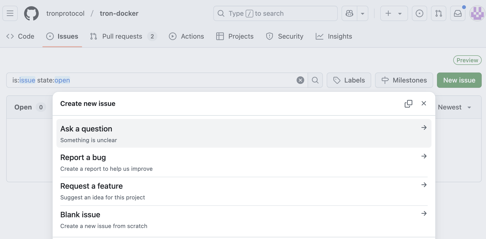
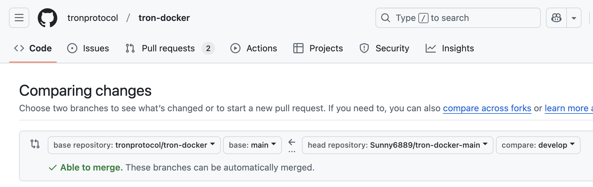

# Contributing

tron-docker is an open-source project designed to facilitate the usage of the TRON network. We understand that there is much left to be desired, and if you see any room for improvement, please let us know. Thank you. All contributed code will be covered by the [LGPLv3 license](https://github.com/tronprotocol/tron-docker/blob/main/LICENSE) of this project.

Here are some guidelines to get started quickly and easily:
- [Contributing](#contributing)
  - [Before contribution](#before-contribution)
    - [Ask a question](#ask-a-question)
    - [Reporting an issue](#reporting-an-issue)
    - [Request a feature](#request-a-feature)
  - [Contribute to tron-docker](#contribute-to-tron-docker)
    - [Key branches](#key-branches)
    - [Submitting code steps](#submitting-code-steps)
      - [Fork then make changes](#fork-then-make-changes)
      - [Linting](#linting)
      - [Push code](#push-code)
    - [Commit messages](#commit-messages)
    - [Branch naming conventions](#branch-naming-conventions)
    - [Pull request best practise](#pull-request-best-practise)
    - [Special situations and how to deal with them](#special-situations-and-how-to-deal-with-them)
  - [Conduct](#conduct)

## Before contribution

Before making any modifications to tron-docker, it's advisable to discuss your issues or suggestions with the community. They may already be working on similar topics or have them in their roadmap, which can avoid duplicating efforts.

### Ask a question
Feel free to ask any TRON related question to solve your doubt. Please click **Ask a question** in GitHub Issues, then follow the instructions thereafter.



### Reporting an issue

If you're about to raise an issue because you think you've found a problem or bug with tron-docker, please respect the following restrictions:

- Please search for [existing issues](https://github.com/tronprotocol/tron-docker/issues?q=is%3Aissue%20state%3Aclosed%20OR%20state%3Aopen). Help us keep duplicate issues to a minimum by checking to see if someone has already reported your problem or requested your idea.
- Use the [Report a bug](.github/ISSUE_TEMPLATE/report-a-bug.md) template.

### Request a feature

If you have any good feature suggestions for tron-docker, community would be very welcome to hear them. Please refer to our [Request a feature](.github/ISSUE_TEMPLATE/request-a-feature.md) template.


## Contribute to tron-docker

If you’d like to contribute to tron-docker, we recommend that you send a pull request (PR) for the maintainers to review and merge into the main code base, make sure the PR contains a detailed description.


### Key branches

tron-docker only has `main`, `develop`, `release-*`, `feature-*`, and `hotfix-*` branches, which are described below:

- ``develop`` branch
  - The `develop` branch only accept merge request from other forked branches or`release_*` branches. It is not allowed to directly push changes to the `develop` branch. A `release_*` branch has to be pulled from the develop branch when a new build is to be released.

- ``main`` branch:
  - `release_*` branches and `hotfix/*` branches should only be merged into the `main` branch when a new build is released.

- ``release`` branch
  - `release_*` is a branch pulled from the `develop` branch for release. It should be merged into `main` after a regression test and will be permanently kept in the repository. If a bug is identified in a `release_*` branch, its fixes should be directly merged into the branch. After passing the regression test, the `release_*` branch should be merged back into the `develop` branch. Essentially, a `release_*` branch serves as a snapshot for each release.

- ``feature`` branch:
  - `feature/*` is an important feature branch pulled from the `develop` branch. After the `feature/*` branch is code-complete, it should be merged back to the `develop` branch. The `feature/*` branch is maintainable.

- ``hotfix`` branch
  - It is pulled from the `main` branch and should be merged back into the main branch and the `develop` branch. Only pull requests of the fork repository (pull requests for bug fixes) should be merged into the `hotfix/` branch. `hotfix/` branches are used only for fixing bugs found after release.


### Submitting code steps

If you want to contribute codes to tron-docker, please follow the following steps.

#### Fork then make changes
Fork a new repository from tronprotocol/tron-docker to your personal code repository, and then edit the code in the your fork repository.
```
  git clone https://github.com/yourname/tron-docker.git
  git remote add upstream https://github.com/tronprotocol/tron-docker.git ("upstream" refers to upstream projects repositories, namely tronprotocol's repositories, and can be named as you like it. We usually call it "upstream" for convenience)
```

Before developing new features, please synchronize your fork repository with the upstream repository.
```
  git fetch upstream
  git checkout develop
  git merge upstream/develop --no-ff (Add --no-ff to turn off the default fast merge mode)
```

Pull a new branch from the **develop** branch of your repository for local development. Please refer to [Branch Naming Conventions](#Branch-Naming-Conventions).
```
  git checkout -b feature/branch_name develop
```

Write and commit the new code when it is completed. Please refer to [Commit Messages](#Commit-Messages).
```
  git add .
  git commit -m 'commit message'
```
Commit the new branch to your personal remote repository.
```
  git push origin feature/branch_name
```

#### Linting

  tron-docker CI uses [pre-commit](https://pre-commit.com/) to lint all code within the repo. Add it to your local following the [installation](https://pre-commit.com/#installation). And ensure ShellCheck is also installed, refer to [installation](https://github.com/koalaman/shellcheck?tab=readme-ov-file#installing). Check [.pre-commit-config.yaml](.pre-commit-config-fix.yaml) for existing validators.

#### Push code

Submit a pull request (PR) from your repository to `tronprotocol/tron-docker`. Please be sure to click on the link in the red box shown below. Select the base branch for tron-docker and the compare branch for your personal fork repository.



The tron-docker maintainers will then review the PR and offer feedback and modifications when necessary. Once adopted, the PR will be closed and merged into the `develop` branch.

We are glad to receive your pull requests and will try our best to review them as soon as we can. Any pull request is welcome, even if it is for a typo.

Please do not be discouraged if your pull request is not accepted, as it may be an oversight. Please explain your code as detailed as possible to make it easier to understand.


### Commit messages

Commit messages should follow the rule below with less than 50 characters in length. We provide a template corresponding instructions.

Template:
```
<commit type>(<scope>): <subject>
<BLANK LINE>
<body>
<BLANK LINE>
<footer>
```

The message header is a single line that contains succinct description of the change containing a `commit type`, an optional `scope` and a subject.

`commit type` describes the kind of change that this commit is providing:
* feat     (new feature)
* fix      (bug fix)
* docs     (changes to documentation)
* style    (formatting, missing semicolons, etc. no code change)
* refactor (refactoring production code)
* test     (adding or refactoring tests. no production code change)
* chore    (updating grunt tasks etc. no production code change)

The `scope` can be anything specifying place of the commit change. For example: `private_net`,`metric_monitor`,`conf`.You can use * if there isn't a more fitting scope.

The subject contains a succinct description of the change:
1. Limit the subject line, which briefly describes the purpose of the commit, to 50 characters.
2. Start with a verb and use first-person present-tense (e.g., use "change" instead of "changed" or "changes").
3. Do not capitalize the first letter.
4. Do not end the subject line with a period.
5. Avoid meaningless commits. It is recommended to use the git rebase command.

Message body use the imperative, present tense: "change" not "changed" nor "changes". The body should include the motivation for the change and contrast this with previous behavior.

Here is an example:
```
fix(private_net): update docker-compose

1. fix docker-compose container tron-node1 command paramters, add more JVM GC flags
2. update the corresponding JVM flags explanation in README.md

Closes #1234
```
If the purpose of this submission is to modify one issue, you need to refer to the issue in the footer, starting with the keyword Closes, such as `Closes #1234`,if multiple bugs have been modified, separate them with commas,such as `Closes #123, #245, #992`.


### Branch naming conventions

1. Always name the `main` branch and `develop` branch as "main" and "develop".
2. Name the `release_*` branch using version numbers, which are assigned by the project lead (e.g., Odyssey-v3.1.3, 3.1.3, etc.).
3. Use `hotfix/` as the prefix of the `hotfix` branch, briefly describe the bug in the name, and connect words with underline (e.g., hotfix/typo, hotfix/null_point_exception, etc.).
4. Use `feature/` as the prefix of the `feature` branch, briefly describe the feature in the name, and connect words with underline (e.g., feature/new_resource_model, etc.).

### Pull request best practise

1. Create one PR for one issue.
2. Avoid massive PRs.
3. Write an overview of the purpose of the PR in its title.
4. Write a description of the PR for future reviewers.
5. Elaborate on the feedback you need (if any).
6. Do not capitalize the first letter.
7. Do not put a period (.) in the end.


### Special situations and how to deal with them
As a reviewer, you may find yourself in one of the situations below. Here’s how to deal with those:

The author doesn’t follow up: ping them after a while (i.e. after a few days). If there is no further response, close the PR or complete the work yourself.

Author insists on including refactoring changes alongside bug fix: We can tolerate small refactorings alongside any change. If you feel lost in the diff, ask the author to submit the refactoring as an independent PR, or at least as an independent commit in the same PR.

Author keeps rejecting your feedback: reviewers have authority to reject any change for technical reasons. If you’re unsure, ask the team for a second opinion. You may close the PR if no consensus can be reached.

## Conduct
While contributing, please be respectful and constructive, so that participation in our project is a positive experience for everyone.

Examples of behavior that contributes to creating a positive environment include:

- Using welcoming and inclusive language
  Being respectful of differing viewpoints and experiences
- Gracefully accepting constructive criticism
- Focusing on what is best for the community
- Showing empathy towards other community members

Examples of unacceptable behavior include:

- The use of sexualized language or imagery and unwelcome sexual attention or advances
- Trolling, insulting/derogatory comments, and personal or political attacks
- Public or private harassment
- Publishing others’ private information, such as a physical or electronic address, without explicit permission
- Other conduct which could reasonably be considered inappropriate in a professional setting
