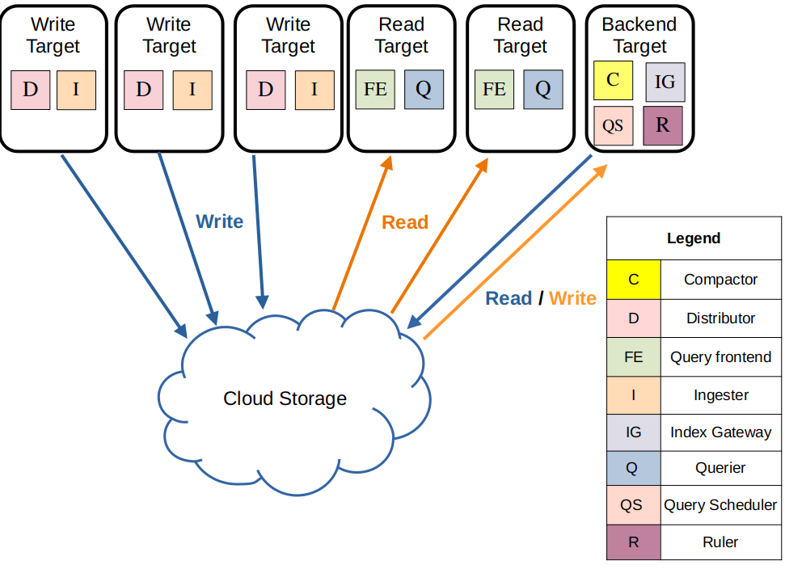

# Loki Deployment Guidance
## Loki components

We need to understand the Loki [components](https://grafana.com/docs/loki/latest/get-started/components/#loki-components) to better build a reliable Loki logging system. Reliability includes scalability to maintain high performance, high availability to ensure service stability, and persistence to ensure data is not lost.

Loki is composed of several components, each responsible for different aspects of log processing and storage.
Here is an overview of [Loki architecture](https://grafana.com/docs/loki/latest/get-started/architecture/#loki-architecture):


Notice: Grafana Loki has a microservices-based architecture and is designed to run as a horizontally scalable,
distributed system.
Thus, it can be deployed in a single-node or multi-node cluster mode (Cluster Services).


The main components of Loki are:
1. **Distributor**
   - **Role**: The distributor is responsible for handling incoming push requests from clients. It validates the streams and forwards them to ingesters.
   - **Key Features**: Validation and reliable acknowledgment.
     Distributor will validate each stream for correctness and to ensure that it is within the configured tenant(or global) limits.
     In cluster mode, each valid stream is then sent to n([replication_factor](https://grafana.com/docs/loki/latest/get-started/components/#replication-factor))
     ingesters in parallel, only returning success to the client once a quorum of ingester has acknowledged the writing success.
     If an ingester fails to write the stream, the distributor will retry the writing to another ingester.

2. **Ingester**
   - **Description**: The ingester receives and validates log streams from distributors, stores them temporarily in memory, and periodically flushes them to long-term storage. It returns recently ingested, in-memory log data for queries on the read path.
   - **Key Features**: In-memory storage, chunk creation, and flushing to long-term storage.
     - **Write Ahead Log (WAL)**: Ensures data is not lost in case of a crash by persisting incoming writes to disk.
     - **Replication Factor**: Generally, in cluster mode the [replication\_factor](https://grafana.com/docs/loki/latest/get-started/components/#replication-factor) is 3. This allows for ingester restarts and rollouts without failing writes, adds additional protection from data loss, and helps in achieving high availability and fault tolerance.

3. **Querier Frontend**
    - **Description**: The querier frontend receives queries from clients, splits them into sub-queries, and forwards them to queriers.
    - **Key Features**: Query splitting and forwarding.
      - **Query Splitting**: The querier frontend splits queries into sub-queries to be executed in parallel by queriers.
      - **Query Forwarding**: The querier frontend forwards sub-queries to queriers, which fetch data from ingesters and long-term storage.
      - **Query Merging**: The querier frontend merges results from multiple queriers to provide a single response to the client.

4. **Querier**
   - **Description**: The querier executes LogQL queries, fetching data from both ingesters and long-term storage.
   - **Key Features**: Query execution, data fetching, and deduplication.
     - **Deduplication**: The querier deduplicates data from multiple ingesters to ensure that the same log lines are not returned multiple times.
     - **Query Parallelism**: The querier can fetch data from multiple ingesters in parallel to speed up query execution.
     - **Query Merging**: The querier merges results from multiple ingesters to provide a single response to the query frontend.

5. **Compactor**
   - **Description**: The compactor consolidates multiple index files produced by ingesters into single index files per day and tenant.
   - **Key Features**: Index file compaction and optimization.
     - **Index Compaction**: The compactor reduces the number of index files by merging them into larger files, improving query performance and reducing storage overhead.

Besides the above compulsory main parts, there are other optional components that can be added to the Loki system to enhance its functionally.
These components can be omitted if the existing architecture already meets performance requirements.
Refer to the [official documentation](https://grafana.com/docs/loki/latest/get-started/components/) for complete components lists and details.

Here is the log data flow with Loki components:


**Write Path**
- The distributor receives an HTTP POST request with streams and log lines. The distributor hashes and send each stream to the ingester and its replicas.
- The ingester receives the stream, creates a chunk, and acknowledges the writing.
- The distributor waits for a quorum of ingesters to acknowledge their writings.
- The distributor responds with a success or error status code.

**Read Path**
- The query frontend(optional) receives an HTTP GET request with a LogQL query. It splits the query into sub-queries and passes them to the query scheduler.
- The querier pulls sub-queries from the scheduler(optional).
- The querier queries all ingesters for in-memory data and the backing store for long-term data.
- The querier deduplicates data and returns the result to the query frontend.
- The query frontend merges the results and returns them to the client.

## Loki deployment modes
Loki can be deployed in different modes to meet different requirements for scalability, availability, and complexity.
Refer to [deployment-modes](https://grafana.com/docs/loki/latest/get-started/deployment-modes/), there are three deployment modes for Loki:

| Deployment Mode                  | Description                                                                                                                                   | Pros                                                                                                                        | Cons                                                                 | Suitable Log Volumes                |
|----------------------------------|-----------------------------------------------------------------------------------------------------------------------------------------------|-----------------------------------------------------------------------------------------------------------------------------|----------------------------------------------------------------------|-------------------------------------|
| Monolithic Mode                  | All Loki components run within a single process.                                                                                              | Easy to deploy and manage. It's useful for getting started quickly to experiment with Loki.                                 | Limited scalability. Not suitable for high availability.             | Up to approximately 20GB per day.   |
| Cluster Mode - Simple Scalable   | Group components into read, write, and backend services, and each service can be scaled independently. | - Better scalability compared to monolithic mode. <br/> - Easier to manage than microservices mode.                         | More complex than monolithic mode. Limited scalability compared to microservices mode. | Up to a few TBs of logs per day.    |
| Cluster Mode - All Microservices | Each Loki component runs as a separate microservice.                                                                                          | - Highly scalable. Suitable for very large deployments. <br/> - Allows precise control over scaling and cluster operations. | Most complex to set up and maintain. Requires more resources and expertise. | Suitable for very large clusters and high log volumes beyond a few TBs per day. |

**java-tron logs volume:**
- A single java-tron fullnode produces less than 1GB of logs per day while syncing up with the Mainnet.
- As loki could connect with multiple java-tron fullnodes or other related services, the log volume could be higher than 20GB per day.

Considering all these factors, below we will show the deployment guidance of Monolithic Mode and Simple Scalable Cluster Mode, as they can satisfy most usage cases with scalability and availability.
If microservices mode is required for your architecture, please refer to the official [guide](https://grafana.com/docs/loki/latest/get-started/deployment-modes/) for more details.

## Loki monolithic development mode as quick start
Refer to [Loki monolithic development mode](README.md#loki-setup) for more details.

## Loki cluster development mode - simple scalable
As your logging system grows and you need to handle more than 20GB of logs per day, or require high availability for your logging infrastructure, the monolithic mode may become insufficient. The simple scalable cluster mode offers a balanced approach between scalability and operational complexity, making it ideal for medium to large-scale deployments.

Loki’s simple scalable deployment mode separates execution paths into read, write, and backend targets. These targets can be scaled independently, letting you customize your Loki deployment to meet your business needs for log ingestion and log query.



The simple scalable deployment mode requires a reverse proxy to be deployed in front of Loki, to direct client API requests to either the read or write nodes.
### Hardware Requirements for simple scalable cluster mode

For a simple scalable Loki cluster deployment, here are the recommended hardware requirements per target replica:

| Component | Resource | Minimum Requirement | Purpose |
|-----------|----------|-------------------|----------|
| Write Target (stateful) | CPU | 2 cores | Log processing and ingestion |
| | Memory | 4GB | In-memory buffers and WAL |
| | Storage | 20GB SSD | Write-ahead log and local cache before flush out |
| Read Target (stateless) | CPU | 2 cores | Query processing |
| | Memory | 2GB | Query execution and caching |
| Backend Target(stateful) | CPU | 2 cores | Daily index compaction and alert rule evaluation  |
| | Memory | 10GB | Index manipulation operations  |
| | Storage | 10GB SSD | local cache |
| | | |

### Deploy simple scalable cluster mode with helm
We utilize Helm Charts to deploy Grafana Loki in simple scalable mode within a Kubernetes cluster. Helm is essential for leveraging Kubernetes-native features such as auto-recovery, rolling updates, and horizontal scaling - capabilities that are crucial for maintaining reliable log ingestion Service Level Agreements (SLAs) in production environments.

1. Add Helm Repositories
```bash
# Add Grafana's Helm repository
helm repo add grafana https://grafana.github.io/helm-charts
helm repo update
```

2. Deploy Loki Cluster

```bash
# Install Loki with custom values file
helm install loki grafana/loki --values ./helm/loki-values.yml

# Port-forward Loki Gateway for local access
kubectl port-forward  svc/loki-gateway 3100:80 &
```
3. Deploy Grafana

```bash
# Install Grafana with custom values
helm install grafana grafana/grafana --values ./helm/grafana-values.yml

# Port-forward Grafana service
kubectl port-forward  svc/grafana 3000:3000 &
```
Then you could open grafana using http://localhost:3000, the user name is `admin`, and the password is retreived by below command:
``` sh
# Retrieve auto-generated admin password
kubectl get secret  grafana -o jsonpath="{.data.admin-password}" | base64 --decode
```

4. Upgrade Deployments (When Making Changes)
```sh
# Update Loki configuration
helm upgrade loki grafana/loki  --values ./helm/loki-values.yml

# Update Grafana configuration
helm upgrade grafana grafana/grafana --values ./helm/grafana-values.yml
```


The [loki-values.yml](./helm/loki-values.yml) Helm config deploys the following components:
- Read component (3 replicas)
- Write component (3 replicas)
- Backend component (3 replicas)
- Gateway (1 NGINX replica)
  - Reverse proxy to be deployed in front of Loki, to direct client API requests to either the read or write nodes.
- Minio
  - Used for remote logs index and chunk storage
- Loki Canary (1 DaemonSet)
  - A monitoring component that continuously verifies the Loki logging pipeline by writing and querying logs. It helps detect issues with log ingestion and retrieval, acting as an early warning system for potential problems in the logging infrastructure.
- Index and Chunk cache (1 replica)
  - A memory caching system that improves query performance by caching frequently accessed index and chunk data

Depending on your workload, you can adjust the number of replicas for each component to meet your specific requirements.
