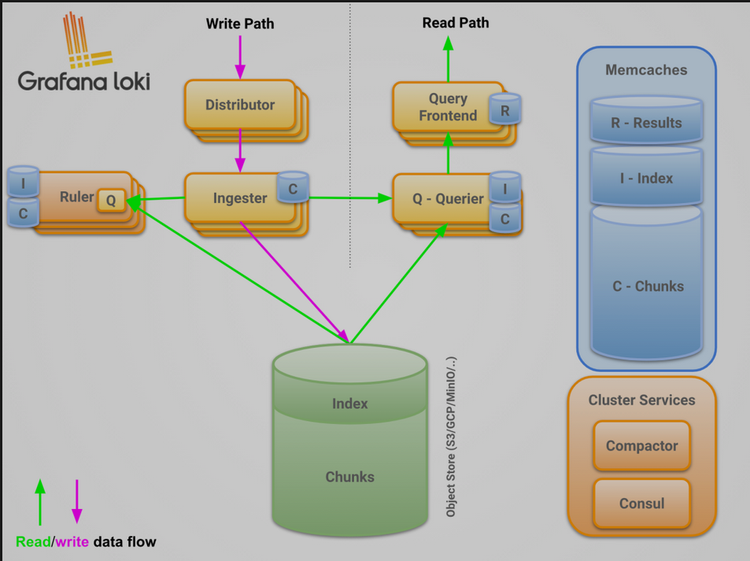

# java-tron Logs Monitor

## Background

In our monitoring setup, we have chosen to use Loki for log collection. Loki is a lightweight, cost-effective log aggregation system designed to work seamlessly with Grafana. By integrating Loki with Grafana, we can monitor the logs of our services to gain insights into their status and performance. This combination allows us to create alerts based on log data, enabling proactive monitoring and quick response to potential issues.

The key benefits of using Loki with Grafana include:
- **Simplicity**: Loki's architecture is simpler and easier to set up compared to ElasticSearch.
- **Cost Efficiency**: Loki's lightweight nature reduces resource consumption and operational costs.
- **Seamless Integration**: Loki integrates natively with Grafana, providing a unified interface for both metrics and logs.
- **Scalability**: Loki can scale horizontally to handle large volumes of log data.
- **Multi-tenancy**: Loki allows multiple tenants(datasource) to share a single Loki instance. With multi-tenancy, the data and requests of each tenant is completely isolated from the others.

In the following sections, we will guide you through the java-tron log system setup process with Loki and Grafana, and demonstrate how to configure alerts based on log data to ensure the health and performance of your services.

### Architecture Overview


A typical Loki-based logging stack consists of 3 components:

- **Agent** - An agent or client, in this case we choose Promtail, which is distributed with Loki. The agent scrapes logs, turns the logs into streams by adding labels, and pushes the streams to Loki through an HTTP API.

- **Loki** - The main server, responsible for ingesting and storing logs and processing queries. It can be deployed in three different configurations, for more information see deployment modes.

- **Grafana** for querying and displaying log data. You can also query logs using the Loki API directly.

Refer the official loki architecture [guide](https://grafana.com/docs/loki/latest/architecture/) for more details.

## Prerequisites

java-tron has configured to output all its logs to `tron.log` file

## Setup

### java-tron setup

### Promtail setup

https://grafana.com/docs/loki/latest/send-data/promtail/configuration
持久化

### Loki setup

#### Loki components
Loki stored compressed log data in chunks in object stores such as S3 or GCS, or even locally on the filesystem.


Distributor
distributor 服务负责处理客户端写入的日志，它本质上是日志数据写入路径中的第一站，一旦 distributor 收到日志数据，会将其拆分为多个批次，然后并行发送给多个 ingester。

Ingester
ingester 服务负责将日志数据写入长期存储后端（DynamoDB、S3、Cassandra 等）。此外 ingester 会验证摄取的日志行是按照时间戳递增的顺序接收的（即每条日志的时间戳都比前面的日志晚一些），当 ingester 收到不符合这个顺序的日志时，该日志行会被拒绝并返回一个错误。

如果传入的行与之前收到的行完全匹配（与之前的时间戳和日志文本都匹配），传入的行将被视为完全重复并被忽略。
如果传入的行与前一行的时间戳相同，但内容不同，则接受该日志行。这意味着同一时间戳有两个不同的日志行是可能的。
来自每个唯一标签集的日志在内存中被建立成 chunks(块)，然后可以根据配置的时间间隔刷新到支持的后端存储。在下列情况下，块被压缩并标记为只读：
- 当前块容量已满（该值可配置）
- 过了太长时间没有更新当前块的内容
- 刷新了

如果一个 ingester 进程崩溃或突然退出，所有尚未刷新的数据都会丢失。Loki 通常配置为多个副本（通常是 3 个）来降低这种风险。
WAL

上面我们也提到了 ingesters 将数据临时存储在内存中，如果发生了崩溃，可能会导致数据丢失，而 WAL 就可以帮助我们来提高这方面的可靠性。

在计算机领域，WAL（Write-ahead logging，预写式日志）是数据库系统提供原子性和持久化的一系列技术。
Loki 中的 WAL 记录了传入的数据，并将其存储在本地文件系统中，以保证在进程崩溃的情况下持久保存已确认的数据。重新启动后，Loki 将重放日志中的所有数据，然后将自身注册，准备进行后续写操作。这使得 Loki 能够保持在内存中缓冲数据的性能和成本优势，以及持久性优势（一旦写被确认，它就不会丢失数据）。


Refer the official loki configuration [guide](https://grafana.com/docs/loki/latest/configuration/) for more details.


```
# This is a complete configuration to deploy Loki backed by a s3-compatible API, like MinIO for storage.

auth_enabled: false

server:
  http_listen_port: 3100

common:
  ring:
    instance_addr: 127.0.0.1
    kvstore:
      store: inmemory
  replication_factor: 1
  path_prefix: /loki

block_builder:
  concurrent_flushes: 8 # How many flushes can happen concurrently?
  sync_interval: 10s # The interval at which to sync job status with the scheduler.

# Configures the chunk index schema and where it is stored.
schema_config:
  configs:
    - from: 2020-05-15 #
      store: tsdb
      object_store: s3
      schema: v13
      index:
        prefix: index_
        period: 24h

# Index files will be written locally at /loki/index and, eventually, will be shipped to the storage via tsdb-shipper.
storage_config:
  tsdb_shipper:
    active_index_directory: /loki/index
    cache_location: /loki/index_cache
  aws:
    s3: s3://minio:melovethanos@minio.:9000/loki # The endpoint for the s3-compatible API.
    s3forcepathstyle: true
```
loki ingester?
持久化

## TroubleShooting
1. If your java-tron node exits unexpectedly but the `tron.log` file does not give you any clue or there is no error message.
   - One possible reason is that the node is killed by the OOM killer. You could verify it by check the docker exit status using command `docker ps -a`. If the exit status is 137, it means the container is killed by the OOM killer. You could also check the `gc.log` files to see if there are any Full GC logs. If there are many Full GC logs, it means the JVM is running out of memory and the OOM killer may kill the container. Make sure each java-tron service has at least 16GB memory
