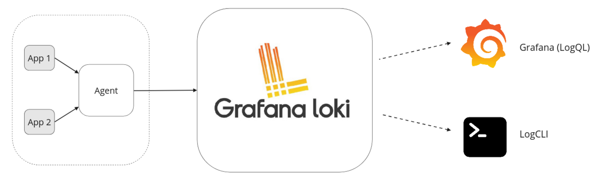
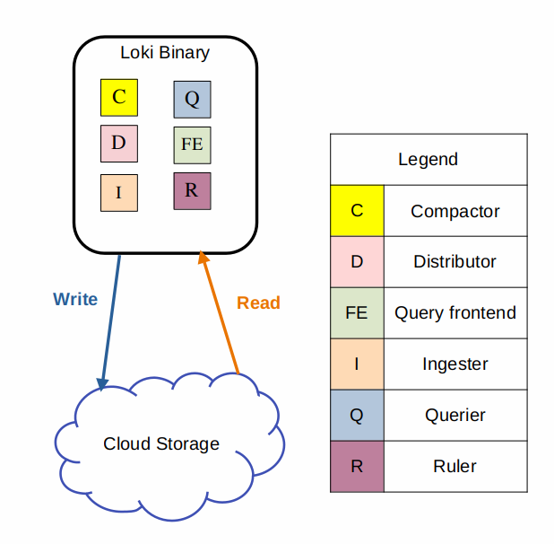

# java-tron Logs Monitor

## Background

In our monitoring setup, we have chosen to use Loki for log collection. Loki is a lightweight, cost-effective log aggregation system designed to work seamlessly with Grafana. By integrating Loki with Grafana, we can monitor the logs of our services to gain insights into their status and performance. This combination allows us to create alerts based on log data, enabling proactive monitoring and quick response to potential issues.

The key benefits of using Loki with Grafana include:
- **Simplicity**: Loki's architecture is simpler and easier to set up compared to ElasticSearch.
- **Cost Efficiency**: Loki's lightweight nature reduces resource consumption and operational costs.
- **Seamless Integration**: Loki integrates natively with Grafana, providing a unified interface for both metrics and logs.
- **Scalability**: Loki can scale horizontally to handle large volumes of log data.
- **Multi-tenancy**: Loki allows multiple tenants(users) to share a single Loki instance. With multi-tenancy, the data and requests of each tenant is completely isolated from the others.

In the following sections, we will guide you through the java-tron log system setup process with Loki and Grafana.
Then, we will demonstrate how to search log and configure alerts to ensure the health and performance of your services.

### Architecture Overview



A typical Loki-based logging stack consists of 3 components:

- **Agent** - An agent or client, in this case we choose Promtail. The agent scrapes logs, turns the logs into streams by adding labels, and pushes the streams to Loki through an HTTP API. There could be one App associated with one agent.

- **Loki** - The main server, responsible for ingesting and storing logs and processing queries.

- **Grafana** for querying and displaying log data. You can also query logs using the Loki API directly.

## Environment Prerequisites

- Docker and Docker Compose

   For Docker and Docker Compose installation refer [prerequisites](../README.md#prerequisites).
   Then check the Docker resource settings to ensure it has at least 16GB of memory per java-tron service.

- Helm and Kubernetes (Optional)
   If you need to deploy Loki cluster mode, you need to install Helm 3 or above and set up Kubernetes (must have at least 3 nodes) on the host machines.
   Refer to the [official documentation](https://helm.sh/docs/intro/install/) for latest Helm installation and the [official documentation](https://kubernetes.io/docs/tasks/tools/install-kubectl/) for Kubernetes installation.

- Hardware Requirement

   The hardware requirements for deploying the logging system depend on your deployment strategy. Among all services, java-tron nodes consume the most system resources and therefore determine the baseline hardware requirements.

   For a quick setup with all services (java-tron, Promtail, Loki, and Grafana) running on a single machine:
   - Follow the [minimum hardware requirements](../single_node/README.md#hardware-requirements) specified for java-tron nodes
   - This configuration is sufficient as java-tron's resource demands exceed those of the logging components
   - If running multiple java-tron nodes, scale the resources proportionally

   For a production-grade setup with services distributed across different machines:
   - Calculate the total hardware requirements by summing up the individual requirements for each component
   - Refer to the specific hardware requirements detailed in each service's setup section

## java-tron and Promtail setup

java-tron has configured to output all its logs to `tron.log` file
https://grafana.com/docs/loki/latest/send-data/promtail/configuration
持久化

单部署这俩服务硬件要求, 内存，日志，硬盘日志最多占用 50G


## Loki setup
Loki offers deployment options that cater to different reliability and scalability requirements. You can choose between single-node deployment for simpler setups or cluster deployment for enhanced reliability and scalability. For quick start below we will show you how to deploy Loki in monolithic mode. For more information on Loki components and cluster mode deployment, refer to our detailed documentation: [Loki cluster mode guidance](LOKI_ClUSTER_MODE_DEPLOYMENT.md).

Monolithic mode runs all of Loki’s microservice components inside a single process as a single binary or Docker image.




### Hardware Requirements for Loki service with Remote Storage

If you run Loki in monolithic mode, the following minimum specifications are recommended with remote storage:

| Resource | Requirement | Purpose |
|----------|------------|----------|
| CPU | 2 cores | General processing |
| Memory | < 1GB  | Primarily for logs buffer and Write Ahead Log (WAL) |
| Storage | 1~6GB | 6GB is local cache for 7 days log retention (worst case scenario) |
| Remote Storage/Bucket | < 10GB per month | Compressed logs and index |
| | | |

These requirements assume a standard deployment with remote storage configured. Adjust specifications based on your specific workload and retention policies.

### Deploy Loki with Docker Compose
Run Loki and Minio with docker-compose use below command:
```sh
docker-compose -f docker-compose.yml up -d loki minio
```
Minio, an S3-compatible object storage service, is used as the remote storage backend for Loki. This allows Loki to store its log data and indexes in a scalable and durable manner while maintaining compatibility with the S3 API.

Check Loki is running using command:
```sh
curl -s http://localhost:3100/ready
```
If the response is `Ready`, Loki is running successfully. Then you can connect to Loki using Grafana in the below [section](#setup-grafana).

### Key configuration breakdown for Loki
The Loki configuration file used by [docker-compose.yml](docker-compose.yml) located at [loki-local-config.yml](./conf/loki-local-config.yml) refered from the Loki [official website](https://raw.githubusercontent.com/grafana/loki/v3.4.1/cmd/loki/loki-local-config.yaml).

Below are the key configuration components and their settings:

| Component | Parameter | Value | Description |
|-----------|-----------|--------|-------------|
| **Server Configuration** | `http_listen_port` | 3100 | Port for Loki's HTTP API - used by Promtail and Grafana |
| **Common Settings** | `replication_factor` | 1 | Number of replicas for single-node deployment |
| **Schema Configuration** | `object_store` | s3| Storage configuration for MinIO integration |
| | `index.prefix` | tron_logs_ | Prefix used for index files |
| **Storage Settings** | `aws.s3` | Minio connection url | Remote storage |
| | `s3forcepathstyle` | true | Required setting for MinIO S3 compatibility |
| |   |   |   |

## Setup Grafana
Grafana is used for log visualization and querying. It can be used to create dashboards, alerts, and explore log data in real-time.

### Deploy Grafana with Docker Compose

### steps to connect loki in grafana
1. Open Grafana in your browser by visiting `http://localhost:3000`.
2. Log in with the default credentials (username: `admin`, password: `admin`).
3. Add Loki as a data source:
   - Click on the gear icon on the left sidebar to open the Configuration menu.
   - Select `Data Sources` and click on `Add data source`.
   - Choose `Loki` from the list of available data sources.
   - In the HTTP section, set the URL to `http://loki:3100` and click `Save & Test`.
4. Create a new dashboard:
   - Click on the `+` icon on the left sidebar to create a new dashboard.
   - Add a new panel to the dashboard by clicking on `Add new panel`.
   - In the query editor, select the Loki data source and write a LogQL query to retrieve log data.
   - Click `Apply` to see the log data in the panel.
   - Customize the panel settings, such as time range, log level, and log format.
   - Save the dashboard by clicking on the disk icon in the top menu bar.
5. Explore log data:
   - Use the query editor to write LogQL queries to filter and search log data.
   - Create visualizations, alerts, and annotations to monitor log data in real-time.
   - Customize the dashboard layout, theme, and appearance to suit your needs.

### Create Alerts in Grafana

### At last, use grafana to observe Loki service healthiness

## TroubleShooting
1. If your java-tron node exits unexpectedly but the `tron.log` file does not give you any clue or there is no error message.
   - One possible reason is that the node is killed by the OOM killer. You could verify it by check the docker exit status using command `docker ps -a`. If the exit status is 137, it means the container is killed by the OOM killer. You could also check the `gc.log` files to see if there are any Full GC logs. If there are many Full GC logs, it means the JVM is running out of memory and the OOM killer may kill the container. Make sure each java-tron service has at least 16GB memory

添加 Loki 死亡 alert
