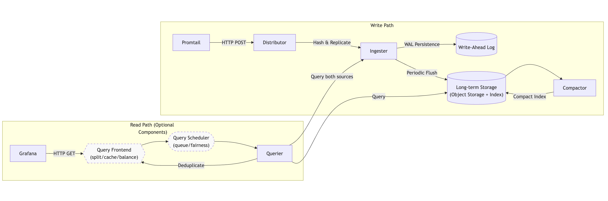

# java-tron Logs Monitor

## Background

In our monitoring setup, we have chosen to use Loki for log collection. Loki is a lightweight, cost-effective log aggregation system designed to work seamlessly with Grafana. By integrating Loki with Grafana, we can monitor the logs of our services to gain insights into their status and performance. This combination allows us to create alerts based on log data, enabling proactive monitoring and quick response to potential issues.

The key benefits of using Loki with Grafana include:
- **Simplicity**: Loki's architecture is simpler and easier to set up compared to ElasticSearch.
- **Cost Efficiency**: Loki's lightweight nature reduces resource consumption and operational costs.
- **Seamless Integration**: Loki integrates natively with Grafana, providing a unified interface for both metrics and logs.
- **Scalability**: Loki can scale horizontally to handle large volumes of log data.
- **Multi-tenancy**: Loki allows multiple tenants(datasource) to share a single Loki instance. With multi-tenancy, the data and requests of each tenant is completely isolated from the others.

In the following sections, we will guide you through the java-tron log system setup process with Loki and Grafana, and demonstrate how to configure alerts based on log data to ensure the health and performance of your services.

### Architecture Overview


A typical Loki-based logging stack consists of 3 components:

- **Agent** - An agent or client, in this case we choose Promtail, which is distributed with Loki. The agent scrapes logs, turns the logs into streams by adding labels, and pushes the streams to Loki through an HTTP API.

- **Loki** - The main server, responsible for ingesting and storing logs and processing queries. It can be deployed in three different configurations, for more information see deployment modes.

- **Grafana** for querying and displaying log data. You can also query logs using the Loki API directly.

Refer the official loki architecture [guide](https://grafana.com/docs/loki/latest/architecture/) for more details.

## Prerequisites

java-tron has configured to output all its logs to `tron.log` file


## java-tron and Promtail setup

https://grafana.com/docs/loki/latest/send-data/promtail/configuration
持久化

## Loki setup

### Loki components introduction

We need to understand the Loki [components](https://grafana.com/docs/loki/latest/get-started/components/#loki-components) to better build a reliable Loki logging system. Reliability includes scalability to maintain high performance, high availability to ensure service stability, and persistence to ensure data is not lost.

Loki is composed of several components, each responsible for different aspects of log processing and storage.
Here is an overview of the data flow in Loki:


**Write Path**
- The distributor receives an HTTP POST request with streams and log lines. The distributor hashes and send each stream to the ingester and its replicas.
- The ingester receives the stream, creates a chunk, and acknowledges the writing.
- The distributor waits for a quorum of ingesters to acknowledge their writings.
- The distributor responds with a success or error status code.

**Read Path**
- The query frontend(optional) receives an HTTP GET request with a LogQL query. It splits the query into sub-queries and passes them to the query scheduler.
- The querier pulls sub-queries from the scheduler.
- The querier queries all ingesters for in-memory data and the backing store for long-term data.
- The querier deduplicates data and returns the result to the query frontend.
- The query frontend merges the results and returns them to the client.

The main components of Loki are:
1. **Distributor**
   - **Role**: The distributor is responsible for handling incoming push requests from clients. It validates the streams and forwards them to ingesters.
   - **Key Features**: Validation and reliable acknowledgment.
     Distributor will validate each stream for correctness and to ensure that it is within the configured tenant(or global) limits.
     Each valid stream is then sent to n([replication_factor](https://grafana.com/docs/loki/latest/get-started/components/#replication-factor)) ingesters in parallel,
     only returning success to the client once a quorum of ingester has acknowledged the writing success.
     If an ingester fails to write the stream, the distributor will retry the writing to another ingester.

2. **Ingester**
   - **Description**: The ingester receives and validates log streams from distributors, stores them temporarily in memory, and periodically flushes them to long-term storage.
   - **Key Features**: In-memory storage, chunk creation, and flushing to long-term storage.
     - **Write Ahead Log (WAL)**: Ensures data is not lost in case of a crash by persisting incoming writes to disk.
     - **Replication Factor**: Generally, the [replication\_factor](https://grafana.com/docs/loki/latest/get-started/components/#replication-factor) is 3. This allows for ingester restarts and rollouts without failing writes, adds additional protection from data loss, and helps in achieving high availability and fault tolerance.

3. **Querier**
   - **Description**: The querier executes LogQL queries, fetching data from both ingesters and long-term storage.
   - **Key Features**: Query execution, data fetching, and deduplication.
     - **Deduplication**: The querier deduplicates data from multiple ingesters to ensure that the same log lines are not returned multiple times.
     - **Query Parallelism**: The querier can fetch data from multiple ingesters in parallel to speed up query execution.
     - **Query Merging**: The querier merges results from multiple ingesters to provide a single response to the query frontend.

4. **Compactor**
   - **Description**: The compactor consolidates multiple index files produced by ingesters into single index files per day and tenant.
   - **Key Features**: Index file compaction and optimization.
     - **Index Compaction**: The compactor reduces the number of index files by merging them into larger files, improving query performance and reducing storage overhead.

Besides the above compulsory main parts, there are other optional components that can be added to the Loki system to enhance its functionally.
These components can be omitted if the existing architecture already meets performance requirements:
- [Query Frontend](https://grafana.com/docs/loki/latest/get-started/components/#query-frontend): Provides API endpoints for queries and speeds up the read path by splitting queries into sub-queries.
- [Query Scheduler](https://grafana.com/docs/loki/latest/get-started/components/#query-scheduler): Provides advanced queuing functionality for queries, ensuring fairness across clients.
- [Ruler](https://grafana.com/docs/loki/latest/get-started/components/#ruler): The ruler evaluates rule and alert expressions, managing rule configurations stored in object storage.


### Loki deployment modes

Refer to [deployment-modes](https://grafana.com/docs/loki/latest/get-started/deployment-modes/), there are three deployment modes for Loki:

| Deployment Mode     | Description                                                                 | Pros                                                                 | Cons                                                                 | Suitable Log Volumes                |
|---------------------|-----------------------------------------------------------------------------|----------------------------------------------------------------------|----------------------------------------------------------------------|-------------------------------------|
| Monolithic Mode     | All Loki components run within a single process.                            | Easy to deploy and manage.                                           | Limited scalability. Not suitable for high availability.             | Up to approximately 20GB per day.   |
| Simple Scalable Mode| Components are separated into different processes and can run on different hosts, but still relatively simple to manage. | Better scalability compared to monolithic mode. Easier to manage than microservices mode. | More complex than monolithic mode. Limited scalability compared to microservices mode. | Up to a few TBs of logs per day.    |
| Microservices Mode  | Each Loki component runs as a separate microservice.                        | Highly scalable. Suitable for very large deployments. Allows precise control over scaling and cluster operations. | Most complex to set up and maintain. Requires more resources and expertise. | Suitable for very large clusters and high log volumes beyond a few TBs per day. |


A single java-tron fullnode produces about 6GB of logs per day while catching up with the Mainnet, with the local highest block number significantly behind the Mainnet.
In a stable state, syncing one block every 3 seconds, it produces less than 2GB(? to confirm) of logs per day.
As loki could connect with multiple java-tron fullnodes or other related services, the log volume could be higher than 20GB per day.
Considering all these factors, below we will show the deployment guidance of Monolithic Mode and Simple Scalable Mode, as they can satisfy most usage cases.
If microservices mode is required for your architecture, please refer to the official [guide](https://grafana.com/docs/loki/latest/get-started/deployment-modes/) for more details.

#### Loki monolithic development mode - quick start


#### Loki simple scalable development mode

硬件要求
https://grafana.com/docs/loki/latest/setup/size/


###
```
# This is a complete configuration to deploy Loki backed by a s3-compatible API, like MinIO for storage.

auth_enabled: false

server:
  http_listen_port: 3100

common:
  ring:
    instance_addr: 127.0.0.1
    kvstore:
      store: inmemory
  replication_factor: 1
  path_prefix: /loki

block_builder:
  concurrent_flushes: 8 # How many flushes can happen concurrently?
  sync_interval: 10s # The interval at which to sync job status with the scheduler.

# Configures the chunk index schema and where it is stored.
schema_config:
  configs:
    - from: 2020-05-15 #
      store: tsdb
      object_store: s3
      schema: v13
      index:
        prefix: index_
        period: 24h

# Index files will be written locally at /loki/index and, eventually, will be shipped to the storage via tsdb-shipper.
storage_config:
  tsdb_shipper:
    active_index_directory: /loki/index
    cache_location: /loki/index_cache
  aws:
    s3: s3://minio:melovethanos@minio.:9000/loki # The endpoint for the s3-compatible API.
    s3forcepathstyle: true
```
loki ingester?
持久化

## TroubleShooting
1. If your java-tron node exits unexpectedly but the `tron.log` file does not give you any clue or there is no error message.
   - One possible reason is that the node is killed by the OOM killer. You could verify it by check the docker exit status using command `docker ps -a`. If the exit status is 137, it means the container is killed by the OOM killer. You could also check the `gc.log` files to see if there are any Full GC logs. If there are many Full GC logs, it means the JVM is running out of memory and the OOM killer may kill the container. Make sure each java-tron service has at least 16GB memory
