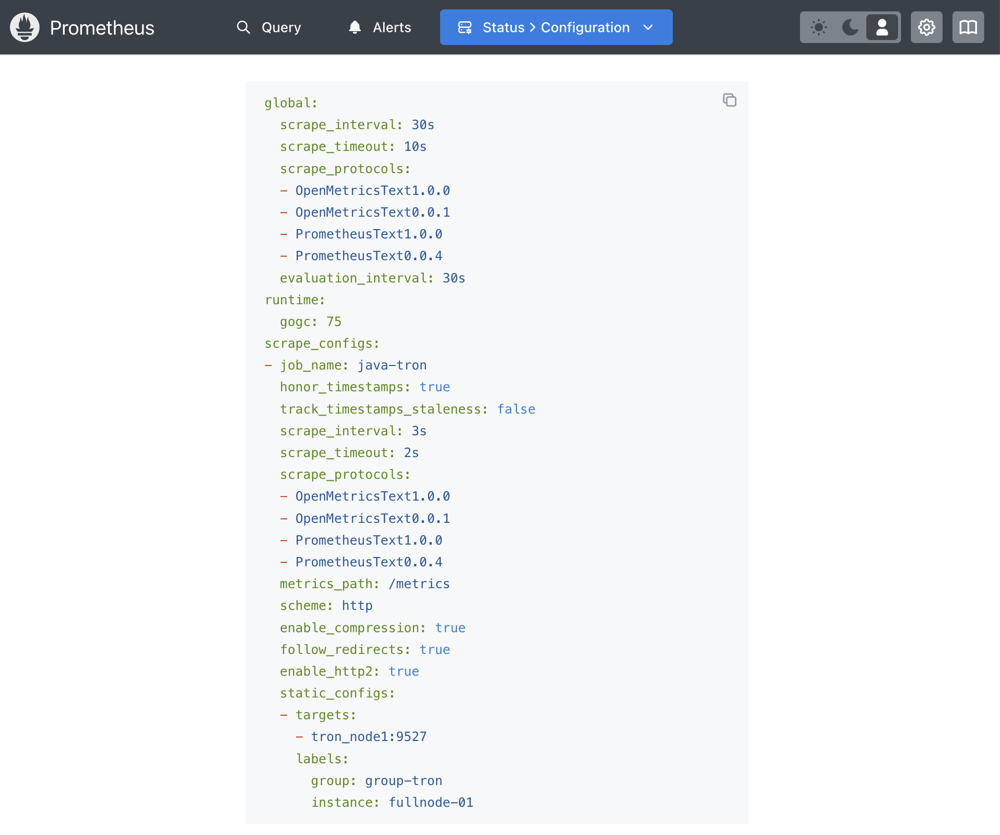
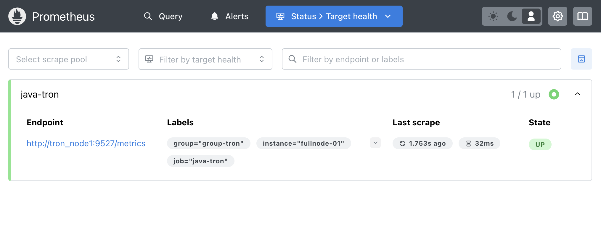
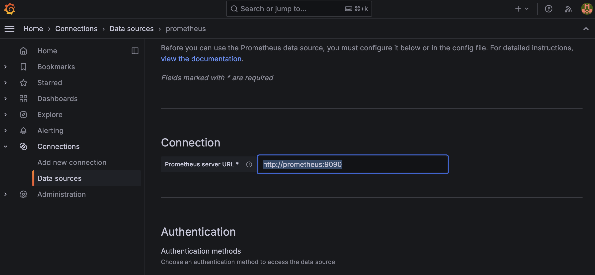
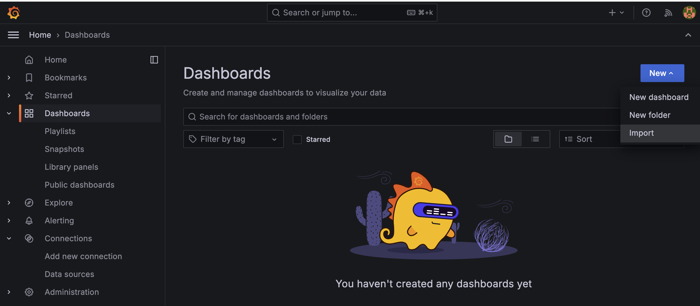
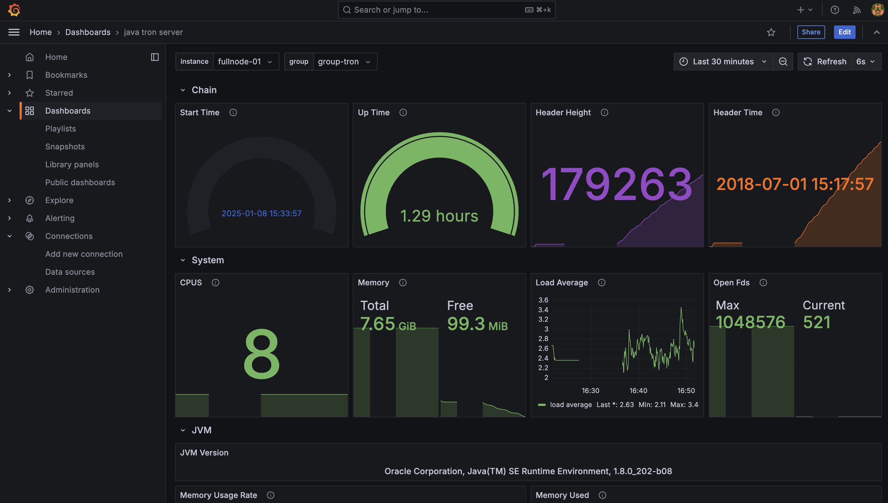

# Tron Node Metrics Monitoring
Starting from the GreatVoyage-4.5.1 (Tertullian) version, the node provides a series of interfaces compatible with the Prometheus protocol, allowing the node deployer to monitor the health status of the node more conveniently.

Below, we provide a guide on using metrics to monitor the Tron node status. Then, we list all available metrics.

## Quick Start
Download the `tron-docker` repository, enter the `metric` directory, and start the services defined in [docker-compose.yml](./docker-compose.yml) using the following command:

```sh
docker-compose up -d
```

It will start a Tron FullNode that connects to the Mainnet, along with Prometheus and Grafana services. Note that in [main_net_config.conf](../conf/main_net_config.conf), it contains the configuration below to enable metrics.
```
metrics{
  prometheus{
    enable=true 
    port="9527"
  }
}
```

### Check Prometheus Service
The Prometheus service will use the configuration file [prometheus.yml](metric_conf/prometheus.yml).It uses the configuration below to add targets for monitoring.
```
- targets:
    - tron_node1:9527 # use container name or local IP address
  labels:
     group: group-tron
     instance: fullnode-01
```

You can view the running status of the Prometheus service at `http://localhost:9090/`. Click on "Status" -> "Configuration" to check whether the configuration file used by the container is correct.


If you want to monitor more nodes, simply add more targets following the same format. Click on "Status" -> "Targets" to view the status of each monitored java-tron node.

**Notice**: Please use `http://localhost:9527/metrics` for all metrics instead of `http://tron_node1:9527/metrics`, as the latter is used for container access inside Docker.

### Check Grafana Service
After startup, you can log in to the Grafana web UI through [http://localhost:3000/](http://localhost:3000/). The initial username and password are both `admin`. After logging in, change the password according to the prompts, and then you can enter the main interface.

Click the settings icon on the left side of the main page and select "Data Sources" to configure Grafana data sources. Enter the ip and port of the prometheus service in URL with `http://prometheus:9090`.


#### Import Dashboard
For the convenience of java-tron node deployers, the TRON community provides a comprehensive dashboard configuration file [grafana_dashboard_tron_server.json](metric_conf/grafana_dashboard_tron_server.json). 
Click the Grafana dashboards icon on the left, then select "New" and "Import", then click "Upload JSON file" to import the downloaded dashboard configuration file:


Then you can see the following monitors displaying the running status of the nodes in real time:


Below, we will introduce all supported metrics to facilitate customizing your dashboard.

## All Metrics
As you can see from above Grafana dashboard or http://localhost:9527/metrics, the available metrics are categorized into the following:

- Blockchain status
- Node system status
- JVM status
- Block and transaction status
- Network peer status
- API information
- Database information

### Blockchain Status
tron:header_time
tron:header_height


### Node System Status
Metric of specific container:
- process_cpu_load: Process cpu load
- process_cpu_seconds_total
- process_max_fds: Maximum number of open file descriptors.
- process_open_fds: Number of open file descriptors.
- process_resident_memory_bytes: Resident memory size in bytes.
- process_start_time_seconds: Start time of the process since unix epoch in seconds.
- process_virtual_memory_bytes

Metric for docker resources:
- system_available_cpus: System available cpus
- system_cpu_load: System cpu load
- system_free_physical_memory_bytes: System free physical memory bytes
- system_free_swap_spaces_bytes: System free swap spaces
- system_load_average: System cpu load average
- system_total_physical_memory_bytes: System total physical memory bytes
- system_total_swap_spaces_bytes: System free swap spaces bytes

### JVM Status

**JVM Basic Info**

- jvm_info: Basic JVM info with version.
- jvm_classes_currently_loaded: The number of classes that are currently loaded in the JVM.
- jvm_classes_loaded_total
- jvm_classes_unloaded_total

**JVM Thread Related**

* jvm_threads_current  
* jvm_threads_daemon 
* jvm_threads_peak 
* jvm_threads_started_total 
* jvm_threads_deadlocked 
* jvm_threads_deadlocked_monitor 
* jvm_threads_state{state="RUNNABLE"} 
* jvm_threads_state{state="TERMINATED"} 
* jvm_threads_state{state="TIMED_WAITING"}  
* jvm_threads_state{state="NEW"} 
* jvm_threads_state{state="WAITING"}  
* jvm_threads_state{state="BLOCKED"}  

**JVM Garbage Collection**

* jvm_gc_collection_seconds_count: Count of JVM garbage collector event.
* jvm_gc_collection_seconds_sum:	Total sum of (Time spent in a given JVM garbage collector in seconds.)

**JVM Memory Related**

* jvm_buffer_pool_capacity_bytes: Bytes capacity of a given JVM buffer pool.
* jvm_buffer_pool_used_buffers: Used buffers of a given JVM buffer pool.
* jvm_buffer_pool_used_bytes:Used bytes of a given JVM buffer pool.
* jvm_memory_bytes_committed: Committed (bytes) of a given JVM memory area.
* jvm_memory_bytes_init: Initial bytes of a given JVM memory area.
* jvm_memory_bytes_max: Max (bytes) of a given JVM memory area.
* jvm_memory_bytes_used: Used bytes of a given JVM memory area.
* jvm_memory_objects_pending_finalization: The number of objects waiting in the finalizer queue.
* jvm_memory_pool_allocated_bytes_created			
* jvm_memory_pool_allocated_bytes_total			
* jvm_memory_pool_bytes_committed: Committed bytes of a given JVM memory pool.
* jvm_memory_pool_bytes_init: Initial bytes of a given JVM memory pool.
* jvm_memory_pool_bytes_max: Max bytes of a given JVM memory pool.
* jvm_memory_pool_bytes_used: Used bytes of a given JVM memory pool.
* jvm_memory_pool_collection_committed_bytes: Committed after last collection bytes of a given JVM memory pool.
* jvm_memory_pool_collection_init_bytes: Initial after last collection bytes of a given JVM memory pool.
* jvm_memory_pool_collection_max_bytes: Max bytes after last collection of a given JVM memory pool.
* jvm_memory_pool_collection_used_bytes: Used bytes after last collection of a given JVM memory pool.


### Block and Transaction Status

Check the usage from dashboard panel, or by searching in [grafana_dashboard_tron_server.json](metric_conf/grafana_dashboard_tron_server.json).

Used to check the block process performance from TronNetDelegate:
- tron:block_process_latency_seconds_bucket: Cumulative counters for the observation buckets (process block latency for TronNetDelegate.)
- tron:block_process_latency_seconds_count: (histogram)	Count of events that have been observed for the histogram metric (process block latency for TronNetDelegate.)
- tron:block_process_latency_seconds_created.
- tron:block_process_latency_seconds_sum: (histogram) Total sum of all observed values for the histogram metric (process block latency for TronNetDelegate.)

Used to check the block process latency from Manager, which is called from TronNetDelegate:
tron:block_push_latency_seconds_bucket: Cumulative counters for the observation buckets (push block latency for Manager.)
tron:block_push_latency_seconds_count: (histogram) Count of events that have been observed for the histogram metric (push block latency for Manager.)
tron:block_push_latency_seconds_created
tron:block_push_latency_seconds_sum: (histogram) Total sum of all observed values for the histogram metric (push block latency for Manager.)

When handling the above block push logic, Tron's processing logic needs to acquire a synchronization lock. `lock_acquire_latency_seconds_x` metric is used to indicate the latency.
- tron:lock_acquire_latency_seconds_bucket: Cumulative counters for the observation buckets (lock acquire latency.)
- tron:lock_acquire_latency_seconds_count: (histogram) Count of events that have been observed for the histogram metric (lock acquire latency.)
- tron:lock_acquire_latency_seconds_created
- tron:lock_acquire_latency_seconds_sum: (histogram) Total sum of all observed values for the histogram metric (lock acquire latency.)

Used to check the block latency received from peer and not from sync request:
- tron:block_fetch_latency_seconds_bucket: Cumulative counters for the observation buckets (fetch block latency.)
- tron:block_fetch_latency_seconds_count: Count of events that have been observed for the histogram metric (fetch block latency.)
- tron:block_fetch_latency_seconds_created
- tron:block_fetch_latency_seconds_sum: Total sum of all observed values for the histogram metric (fetch block latency.)
- tron:block_receive_delay_seconds_bucket: Cumulative counters for the observation buckets (receive block delay time, receiveTime - blockTime.)
- tron:block_receive_delay_seconds_count: (histogram) Count of events that have been observed for the histogram metric (receive block delay time, receiveTime - blockTime.)
- tron:block_receive_delay_seconds_created
- tron:block_receive_delay_seconds_sum: (histogram) Total sum of all observed values for the histogram metric (receive block delay time, receiveTime - blockTime.)


### Network peer status

### API Information

### Database Information

TRON blockchain storage chooses to use LevelDB, which is developed by Google and proven successful with many companies and projects. These below db related metrics all have filters with `db` name and `level`.
- tron:db_size_bytes
- tron:guava_cache_hit_rate: Hit rate of a guava cache.
- tron:guava_cache_request: Request of a guava cache.
- tron:guava_cache_eviction_count: Eviction count of a guava cache.
- tron:db_sst_level: For LevelDB SST file compaction.

Currently, for `db` TRON has below possible objects:
- accountid-index
- abi
- account
- votes
- proposal
- witness
- code
- recent-transaction
- exchange-v2
- market_pair_to_price
- trans
- contract
- storage-row
- block 
- exchange
- DelegatedResource
- tree-block-index
- balance-trace
- market_pair_price_to_order
- asset-issue
- transactionHistoryStore
- IncrementalMerkleTree
- delegation
- transactionRetStore
- account-index
- market_order
- witness_schedule
- nullifier
- DelegatedResourceAccountIndex
- properties
- common
- block-index
- accountTrie
- contract-state
- account-trace
- market_account
- recent-block
- asset-issue-v2
- section-bloom
- tmp


### Other Metrics
Beside above metrics, there are also metrics to measure the duration of a scrape process, which is useful for monitoring and understanding the performance of your Prometheus server and the targets it scrapes. 
- scrape_duration_seconds: It measures the time taken (in seconds) for Prometheus to scrape a target. This includes the entire process of making an HTTP request to the target, receiving the response, and processing the metrics.
- scrape_samples_post_metric_relabeling
- scrape_samples_scraped
- scrape_series_added			


tron:manager_queue_size	gauge	tron manager.queue.size .

tron:message_process_latency_seconds_bucket	counter	Cumulative counters for the observation buckets (process message latency.)
tron:message_process_latency_seconds_count	counter (histogram)	Count of events that have been observed for the histogram metric (process message latency.)
tron:message_process_latency_seconds_created
tron:message_process_latency_seconds_sum	counter (histogram)	Total sum of all observed values for the histogram metric (process message latency.)

tron:miner_created			

tron:miner_total			

tron:p2p_disconnect_created			

tron:p2p_disconnect_total			

tron:p2p_error_created			

tron:p2p_error_total			

tron:peers	gauge	tron peers.size .

tron:ping_pong_latency_seconds_bucket	counter	Cumulative counters for the observation buckets (node ping pong latency.)

tron:ping_pong_latency_seconds_count	counter (histogram)	Count of events that have been observed for the histogram metric (node ping pong latency.)

tron:ping_pong_latency_seconds_created			

tron:ping_pong_latency_seconds_sum	counter (histogram)	Total sum of all observed values for the histogram metric (node ping pong latency.)

tron:process_transaction_latency_seconds_bucket	counter	Cumulative counters for the observation buckets (process transaction latency.)

tron:process_transaction_latency_seconds_count	counter (histogram)	Count of events that have been observed for the histogram metric (process transaction latency.)

tron:process_transaction_latency_seconds_created			

tron:process_transaction_latency_seconds_sum	counter (histogram)	Total sum of all observed values for the histogram metric (process transaction latency.)

tron:tcp_bytes_bucket	counter	Cumulative counters for the observation buckets (tcp_bytes traffic.)

tron:tcp_bytes_count
tron:tcp_bytes_created			

tron:tcp_bytes_sum	counter (histogram)	Total sum of all observed values for the histogram metric (tcp_bytes traffic.)

tron:tx_cache	gauge	tron tx cache info.

tron:udp_bytes_bucket	counter	Cumulative counters for the observation buckets (udp_bytes traffic.)

tron:udp_bytes_count	counter (histogram)	Count of events that have been observed for the histogram metric (udp_bytes traffic.)

tron:udp_bytes_created			

tron:udp_bytes_sum	counter (histogram)	Total sum of all observed values for the histogram metric (udp_bytes traffic.)

tron:verify_sign_latency_seconds_bucket	counter	Cumulative counters for the observation buckets (verify sign latency for trx , block.)

tron:verify_sign_latency_seconds_count	counter (histogram)	Count of events that have been observed for the histogram metric (verify sign latency for trx , block.)

tron:verify_sign_latency_seconds_created			

tron:verify_sign_latency_seconds_sum	counter (histogram)	Total sum of all observed values for the histogram metric (verify sign latency for trx , block.)


