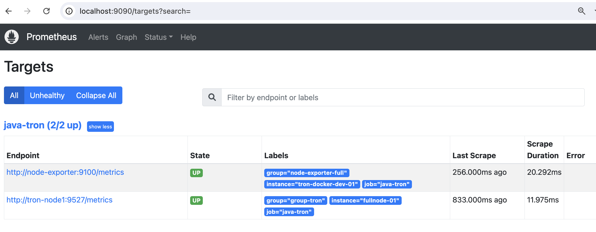

# Use Prometheus Remote Write with Thanos to Monitor java-tron Node

In this document, we will introduce how to use Prometheus remote-write to monitor a java-tron node more securely.

## Background
The previous [README](README.md) explains how to monitor a java-tron node using Grafana and Prometheus. It can be illustrated by the image below:


Basically, the Prometheus service pulls metrics from the java-tron node through an exposed port. Subsequently, Grafana retrieves these metrics from Prometheus to provide visualized insights and alerts.

This quick-start setup is only recommed on test enviornment, as there are some limitations to this approach. From a security perspective, it is essential to separate java-tron services and monitoring services into different network zones. Specifically, we need to isolate java-tron nodes, especially SR nodes, from external exposure to reduce risks such as Denial of Service (DoS) attacks. However, monitoring metrics and similar indicators of TRON blockchain status can be made more accessible to a broader range of users.
To address these concerns, we need to change the pull mode either from the java-tron or Prometheus service to push mode. Refer to Prometheus official documentation of ["Why do you pull rather than push"](https://prometheus.io/docs/introduction/faq/#why-do-you-pull-rather-than-push) and ["When to use the Pushgateway"](https://prometheus.io/docs/practices/pushing/#when-to-use-the-pushgateway), the best practice for long-live observation target is to use Prometheus pull mode, and put java-tron and Prometheus service in the same failure domain.

### New Architecture
Given these considerations, we will implement a push mode for the data flow from Prometheus to Grafana. Prometheus offers a **remote-write** feature that supports push mode, facilitating this transition. We have selected [Thanos](https://github.com/thanos-io/thanos) as an intermediate component. Thanos not only supports remote write but also provides additional features such as long-term storage, high availability, and global querying, thereby improving the overall architecture and functionality of our monitoring system.

The following diagram illustrates our enhanced monitoring system architecture in cluster mode with multiple java-tron services. This design provides improved reliability and scalability through distributed components. In the subsequent sections, we'll guide you through configuring Prometheus remote-write and Thanos services. For simpler use cases where high availability isn't critical, deploying a single Thanos Receive instance may suffice.


## Implementation Guide
This section introduces the steps of setting up Prometheus remote write with Thanos.

### Prerequisites
Before proceeding, ensure you have the following prerequisites:

- Docker and Docker Compose installed (refer to [prerequisites](../README.md#prerequisites))
  - For host machines running a java-tron FullNode, the minimum docker resource requirements, please refer to the [single_node](../single_node/README.md#prerequisites) section.
- A local clone of the tron-docker repository
  ```sh
  git clone https://github.com/tronprotocol/tron-docker.git
  cd tron-docker/metric_monitor
  ```
### Main components
As shown in the new architecture, the monitoring system consists of the following key components:

- **TRON FullNode**: A TRON blockchain node with metric collection capabilities enabled
- **Node Exporter**: A Prometheus exporter that enables comprehensive monitoring of host machine performance and resource consumption. For detailed documentation, see the [Node Exporter](https://github.com/prometheus/node_exporter).
- **Prometheus**: A monitoring service that collects metrics from the java-tron node and forwards them to Thanos Receive using remote write protocol
- **Thanos Receive**: A Thanos component that ingests metrics via Prometheus remote write, exposes them via StoreAPI, and persists them to cloud storage
- **Thanos Query**: A Thanos component implementing Prometheus's v1 API to aggregate and deduplicate metrics from multiple underlying data sources
- **Grafana**: A visualization platform that queries metrics from Thanos Query to create dashboards and alerts

### Step 1: Set up TRON and Prometheus services
Run the below command to start a java-tron FullNode, node exporter and Prometheus services:
```sh
docker-compose -f ./docker-compose/docker-compose-target-node.yml up -d # Start all

docker-compose -f ./docker-compose/docker-compose-target-node.yml up -d tron-node # Start tron-node only
docker-compose -f ./docker-compose/docker-compose-target-node.yml up -d node-exporter # Start node-exporter only
docker-compose -f ./docker-compose/docker-compose-target-node.yml up -d prometheus # Start prometheus only
```

You can verify the Prometheus service status and monitor targets by accessing `http://[host_IP]:9090/` in your browser. Alternatively, use `docker logs -f prometheus` to view the Prometheus service logs.


Review the [docker-compose-fullnode.yml](./docker-compose/docker-compose-target-node.yml) file, the command explanation of the java-tron service can be found in [Run Single Node](../single_node/README.md#run-the-container).

Below are the core configurations for the Prometheus service:
```yaml
  ports:
    - "9090:9090"  # Used for local Prometheus status check
  volumes:
    - ../conf:/etc/prometheus # Path relative to the docker compose file
    - ../prometheus_data:/prometheus
  command:
    - "--config.file=/etc/prometheus/prometheus-remote-write.yml" # Default path to the configuration file
    - "--storage.tsdb.path=/prometheus" # The path where Prometheus stores its metric database
    - "--storage.tsdb.retention.time=30d"
    - "--storage.tsdb.max-block-duration=30m" # The maximum duration for a block of time series data that can be stored in the time series database (TSDB)
    - "--storage.tsdb.min-block-duration=30m"
    - "--web.enable-lifecycle" # Makes Prometheus expose the /-/reload HTTP endpoints
    - "--web.enable-admin-api"
```
#### Key configuration elements:
##### 1. Prometheus configuration file

The Prometheus configuration file is set to use the [prometheus-remote-write.yml](conf/prometheus-remote-write.yml) by volume mapping `./conf/prometheus-remote-write.yml:...` and flag `--config.file=...`. It contains the configuration of `scrape_configs` and `remote_write`.
```yml
global:
  external_labels:
    monitor: 'java-tron-node1-remote-write'  # Unique identifier in Thanos

scrape_configs:
  - job_name: java-tron
    scrape_interval: 1s  # High-frequency monitoring
    ...
    static_configs:
      - targets: tron-node1:9527 # Fill with IP address if the java-tron service run remotely
        labels:
          group: group-tron
          instance: fullnode-01
      - targets:
          - node-exporter:9100  # Node Exporter
        labels:
          group: node-exporter-full
          instance: tron-docker-dev-01

remote_write:
  - url: http://[THANOS_RECEIVE_IP]:10908/api/v1/receive
    headers: # Add necessary header information for authentication or service group differentiation
      X-Service-Group: "tron-fullnode-group1"
    metadata_config:
      send: true  # Enable metric metadata transmission
      send_interval: 1s  # How frequently metric metadata is sent to remote Receive.
      max_samples_per_send: 500  # Batch size optimization
```
- For `global.external_labels`:
  - The `external_labels` defined in the Prometheus configuration file are propagated with all metric data to Thanos Receive. You could add multiple Prometheus services with remote-write to the same Receive service, just make sure the `external_labels` are unique. It uniquely identifies the Prometheus instance, acting as critical tracing metadata that ultimately correlates metrics to their originating java-tron node. You can use it in Grafana dashboards using label-based filtering (e.g., `{monitor="java-tron-node1-remote-write"}`).

    

- For `scrape_configs`:
  - The `scrape_interval` defines the frequency at which Prometheus collects metrics. While configured for 3-second intervals to enable real-time monitoring, this setting can be customized according to your specific monitoring needs. Keep in mind that decreasing the interval will increase the service load, as metrics are collected each time the HTTP request triggered.
  - The `targets` field specifies the java-tron services or other monitoring targets via their IP addresses and ports. Prometheus actively scrapes metrics from these defined endpoints.
  - The `labels` section contains key-value pairs that uniquely identify each target within Prometheus. These labels enable powerful filtering capabilities in Grafana dashboards - for example, you can filter metrics using expressions like `{group="group-tron"}`.

- For `remote_write`:
  - Fill the `url` with the IP address of the Thanos Receive service started in the following step.
  - Check the official documentation [remote_write](https://prometheus.io/docs/prometheus/latest/configuration/configuration/#remote_write) for all configurations' explanation.

##### 2. Storage configurations
- The volumes command `../prometheus_data:/prometheus` mounts a local directory used by Prometheus to store metrics data.
  - Even when using Prometheus with remote-write, metrics data is still temporarily stored locally.
- The `--storage.tsdb.retention.time=7d` flag defines how long metrics data is retained. In this case, Prometheus automatically purges data older than 7 days. For a java-tron(v4.7.6+) FullNode, each metric request returns approximately 9KB of raw data. With a `scrape_interval` of 3 second and TSDB compression, **a single java-tron FullNode service requires about 700MB of Prometheus storage with 7 days of retention**.
- The `--storage.tsdb.max-block-duration=30m` flag defines the maximum duration for generating TSDB blocks locally. With this setting, Prometheus will create new TSDB blocks at intervals no longer than 30 minutes, ensuring regular data persistence and efficient storage management.
- Other storage flags can be found in the [official documentation](https://prometheus.io/docs/prometheus/latest/storage/#operational-aspects). For a quick start, you could use the default values.

#### Alternative way to set up Prometheus and Node Exporter
Grafana Alloy can be used to set up Prometheus and Node Exporter.
##### Alloy configuration file
Please refer to the [prometheus-loki.alloy](./conf/prometheus-loki.alloy) for the Alloy configuration file. You will need to update certain values to match your environment, such as `prometheus.scrape.targets`, `discovery.relabel`  
Note: If you don’t require the Loki feature, you can remove the last two configuration sections that begin with loki.

##### Start Alloy
Use the `.docker-compose/docker-compose-alloy.yml` and the following command to start Alloy.
```sh
docker-compose -f ./docker-compose/docker-compose-alloy.yml up -d
```

### Step 2: Set up Thanos Receive
 The [Thanos Receive](https://thanos.io/tip/components/receive.md/#receiver) service implements the Prometheus Remote Write API. It builds on top of the existing Prometheus TSDB and retains its usefulness while extending its functionality with long-term-storage, horizontal scalability, and downsampling. Prometheus instances are configured to continuously write metrics to it. Thanos Receive exposes the StoreAPI so that Thanos Queriers can query received metrics in real-time.


First, deploy [Minio](https://github.com/minio/minio) for long-term metric storage. Minio offers S3-compatible object storage functionality, allowing Thanos Receive to upload TSDB blocks to storage buckets at 2-hour intervals. While this guide uses Minio, you can opt for any storage service from the [Thanos Supported Clients](https://thanos.io/tip/thanos/storage.md/#supported-clients) list. For long-term monitoring, we recommend implementing a retention policy on your storage service to efficiently manage historical metric data. For instance, you might configure an S3 lifecycle policy when using AWS to automatically remove metrics older than one year.
```sh
# Start Minio
docker-compose -f ./docker-compose/minio.yml up -d

# First set the MinIO alias with root credentials to enable bucket creation permissions
docker exec minio mc alias set local http://localhost:9000 minio melovethanos

# Then create the bucket
docker exec minio mc mb local/test-thanos-001
```

Run the below command to start the Thanos Receive.
```sh
docker-compose -f ./docker-compose/thanos-receive.yml up -d
```
As Promethus has already been configured to send metric metadata to Thanos Receive, check the logs to ensure the Thanos Receive is running properly.

```sh
docker logs -f thanos-receive

...
ts=2025-04-03T03:13:49.395927626Z caller=intrumentation.go:56 level=info component=receive msg="changing probe status" status=ready
ts=2025-04-03T03:13:49.395951876Z caller=receive.go:647 level=info component=receive msg="storage started, and server is ready to receive requests"
...
```


Core configuration for Thanos Receive in [thanos-receive.yml](./docker-compose/thanos-receive.yml):
``` yml
  thanos-receive:
    ...
    container_name: thanos-receive
    volumes:
      - ../receive-data:/receive/data
      - ../conf:/receive # Path relative to the docker compose file
    ports:
      - "10907:10907"
      - "10908:10908"
      - "10909:10909"
    command:
      - "receive"
      - "--tsdb.path=/receive/data"
      - "--tsdb.retention=30d" # How long to retain raw samples on local storage.
      - "--grpc-address=0.0.0.0:10907"
      - "--http-address=0.0.0.0:10909"
      - "--remote-write.address=0.0.0.0:10908"
      - "--label=receive_replica=\"0\""
      - "--label=receive_cluster=\"java-tron-mainnet\""
      - "--objstore.config-file=/receive/bucket_storage.yml"
```
#### Key configuration elements:
##### 1. Storage configuration
- Local Storage:
  `../receive-data:/receive/data` maps the host directory for metric TSDB storage.
  - Retention Policy: The `--tsdb.retention=30d` flag automatically purges data older than 30 days. Based on testing with a java-tron(v4.7.6+) FullNode using a 3-second metric scrape interval, storage consumption averages approximately **3GB of disk space per month**.

- External Storage:
  `../conf:/receive` mounts configuration files. The `--objstore.config-file` flag enables long-term storage in MinIO/S3-compatible buckets. In this case, it is [bucket_storage.yml](conf/bucket_storage.yml).
  - Thanos Receive uploads TSDB blocks to an object storage bucket every 2 hours by default.
  - Fallback Behavior: Omitting this flag keeps data local-only.

##### 2. Network configuration
- Remote Write `--remote-write.address=0.0.0.0:10908`: It allow receive Prometheus metrics from any IP address. Prometheus instances are configured to continuously write metrics to it.
- Thanos Receive exposes the StoreAPI so that Thanos Query can query received metrics in **real-time**.
  - The `ports` combined with flags `--grpc-address, --http-address` expose the ports for the Thanos Query service.
- Security Note: `0.0.0.0` means it accepts all incoming connections from any IP address. For production, consider restricting access to specific IP addresses.

For more flags explanation and default value can be found in the official [Thanos Receive Flags](https://thanos.io/tip/components/receive.md/#flags) documentation.

#### Thanos Receive reliable deployment
For systems monitoring multiple services at scale, it's recommended to implement Thanos Receive in cluster mode as shown in the architecture diagram above. This prevents Thanos Receive from becoming a single point of failure or performance bottleneck. Additionally, deploying a load balancer in front of the Thanos Receive cluster provides a unified entry point and enables automatic request distribution across multiple instances. This setup ensures high availability, improved fault tolerance, and better scalability of your monitoring infrastructure. Further information can be found in the official [Thanos Receive](https://thanos.io/tip/components/receive.md/) documentation. It also supports Kubernetes deployment for better scalability management.

### Step 3: Set up Thanos Store
Thanos Receive manages recent metrics data according to its configured retention policy, while the Store Gateway component enables access to historical metrics that have been archived in object storage, creating a seamless data access layer across both recent and historical time ranges. It keeps a small amount of information about all remote blocks on local disk and keeps it in sync with the bucket. This data is generally safe to delete across restarts at the cost of increased startup times.

Run the below command to start the Thanos Query service:
```sh
docker-compose -f ./docker-compose/thanos-store.yml up -d
```

Check the logs to ensure the Thanos Receive is running properly by running below command:
```sh
docker logs -f thanos-store

// should contains similar information
...
ts=2025-04-03T03:49:49.328449876Z caller=store.go:525 level=info msg="starting store node"
ts=2025-04-03T03:49:49.329349335Z caller=store.go:423 level=info msg="initializing bucket store"
ts=2025-04-03T03:49:49.32941221Z caller=intrumentation.go:75 level=info msg="changing probe status" status=healthy
ts=2025-04-03T03:49:49.32945021Z caller=http.go:73 level=info service=http/server component=store msg="listening for requests and metrics" address=0.0.0.0:10911
ts=2025-04-03T03:49:49.329778668Z caller=tls_config.go:274 level=info service=http/server component=store msg="Listening on" address=[::]:10911
ts=2025-04-03T03:49:49.32979571Z caller=tls_config.go:277 level=info service=http/server component=store msg="TLS is disabled." http2=false address=[::]:10911
ts=2025-04-03T03:49:49.38348421Z caller=fetcher.go:529 level=info component=block.BaseFetcher msg="successfully synchronized block metadata" duration=54.095041ms duration_ms=54 cached=16 returned=16 partial=0
...
```

Core configuration in [thanos-store.yml](./docker-compose/thanos-store.yml):
```yaml
  thanos_store:
    command:
      - "store"
      - "--objstore.config-file=/etc/thanos/bucket_storage.yml"
      - "--grpc-address=0.0.0.0:10912"
```
The Store gateway:

- Connects to our Minio bucket via `bucket_storage.yml`, the same configuration file as Thanos Receive.
- Exposes gRPC endpoint for Thanos Query to access historical data
- Indexes object storage blocks for fast lookups

### Step 4: Set up Thanos Query
As Grafana cannot directly query Thanos Receive, we need Thanos Query that implements Prometheus’s v1 API to aggregate data from the Thanos Receive and Store services. **Querier is fully stateless and horizontally scalable**.

Run the below command to start the Thanos Query service:
```sh
docker-compose -f ./docker-compose/thanos-querier.yml up -d
```

Verify the Thanos Query service is running correctly by checking its logs. The logs should show successful connections to both the Thanos Receive and Store services.
```sh
docker logs -f thanos-querier

// should contains similar information
...
ts=2025-04-03T05:37:53.675695715Z caller=query.go:840 level=info msg="starting query node"
ts=2025-04-03T05:37:53.67593609Z caller=intrumentation.go:75 level=info msg="changing probe status" status=healthy
ts=2025-04-03T05:37:53.675959798Z caller=http.go:73 level=info service=http/server component=query msg="listening for requests and metrics" address=0.0.0.0:9091
ts=2025-04-03T05:37:53.676072548Z caller=intrumentation.go:56 level=info msg="changing probe status" status=ready
ts=2025-04-03T05:37:53.676288048Z caller=tls_config.go:274 level=info service=http/server component=query msg="Listening on" address=[::]:9091
ts=2025-04-03T05:37:53.676313173Z caller=tls_config.go:277 level=info service=http/server component=query msg="TLS is disabled." http2=false address=[::]:9091
ts=2025-04-03T05:37:53.676380298Z caller=grpc.go:131 level=info service=gRPC/server component=query msg="listening for serving gRPC" address=0.0.0.0:10901
ts=2025-04-03T05:37:58.685901342Z caller=endpointset.go:425 level=info component=endpointset msg="adding new receive with [storeEndpoints exemplarsAPI]" address=thanos-receive:10907 extLset="{receive_cluster=\"java-tron-mainnet\", receive_replica=\"0\", tenant_id=\"default-tenant\"}"
ts=2025-04-03T05:37:58.685969217Z caller=endpointset.go:425 level=info component=endpointset msg="adding new store with [storeEndpoints]" address=thanos-store:10912 extLset="{receive_cluster=\"java-tron-mainnet\", receive_replica=\"0\", tenant_id=\"default-tenant\"}"
...
```
Below are the core configurations for the Thanos Query service:
``` yaml
  thanos-querier:
    ...
    container_name: thanos-querier
    ports:
      - "9091:9091"
    command:
      - query
      - --endpoint.info-timeout=30s
      - --http-address=0.0.0.0:9091
      - --query.replica-label=receive_replica # Deduplication turned on for metric with the same replica_label
      - --endpoint=thanos-receive:10907 # The grpc-address of the Thanos Receive service，if Receive run remotely replace container name "thanos-receive" with the real ip, could add multiple receive services
      - --store=thanos-store:10907 # for historical data query
```
It will set up the Thanos Query service
that listens to port 9091 and queries metrics from the Thanos Receive service from `--endpoint=[Thanos Receive IP]:10907`.
Make sure the IP address is correct.

You could add multiple Thanos Receive、Store services to the Querier service. It will do duplication based on the `replica-label`. For more complex usage, please refer to the [official Query document](https://thanos.io/tip/components/query.md/).

### Step 4: Monitor through Grafana
To start the Grafana service on the host machine, run the following command:
```sh
docker-compose -f ./docker-compose/grafana.yml up -d
```
Then log in to the Grafana web UI through http://localhost:3000/ or your host machine's IP address. The initial username and password are both `admin`.
Navigate to the **Connections** menu on the left sidebar and select Prometheus as your data source. In the URL field, enter the Thanos Query service address using the format `http://[Query service IP]:9091`. If running services on the same host, you can use either `http://thanos-querier:9091` or `http://host.docker.internal:9091` (for MacOS).


Follow the same guidance as [Import Dashboard](https://github.com/tronprotocol/tron-docker/blob/main/metric_monitor/README.md#import-dashboard) to import the dashboard templates.
With these components in place, you can now customize your monitoring system by adjusting Thanos and Prometheus configurations to meet your specific requirements. The flexibility of this setup allows you to scale horizontally, implement high availability, and fine-tune metrics collection and storage according to your needs.

### Step 5: Clean up
To stop and remove the monitoring services, use the following commands based on your deployment:

```sh
# Stop and remove all services, if you start all on the same host
docker-compose -f ./docker-compose/docker-compose-all.yml down

# Thanos Receive service only
docker-compose -f ./docker-compose/thanos-receive.yml down

# Node exporter service only
docker-compose -f ./docker-compose/docker-compose-target-node.yml down node-exporter
```

## Troubleshooting

### Common Issues
1. **Container Config Error (Linux)**
- If you encounter a `KeyError: 'ContainerConfig'`, check for conflicting container names and remove them:
   ```bash
  # List all containers
  docker ps -a

  # Remove conflicting containers
  docker rm [container-name]
  ```
2. **Network Connectivity**

- Verify all services can communicate by checking logs:
  ```bash
  docker-compose logs [service-name]
  ```

- Ensure all IP addresses are correctly configured in the docker-compose file
- Ensure all exposed ports are accessible from external services

3. **Storage Issues**

- Check available disk space: `df -h`
- Monitor storage usage in Prometheus, Thanos Receive, and Minio (if used) directories

### Getting Help
For additional support:
- Raise an issue on [GitHub](https://github.com/tronprotocol/tron-docker/issues)
- Consult the official Thanos documentation
- Review Docker logs for specific service issues

## Conclusion
This guide provides a secure and scalable solution for monitoring java-tron nodes. For custom configurations beyond this setup, refer to the [official Thanos documentation](https://thanos.io/tip/thanos/quick-tutorial.md/) or engage with the community on [GitHub](https://github.com/tronprotocol/tron-docker/issues) Issue.
