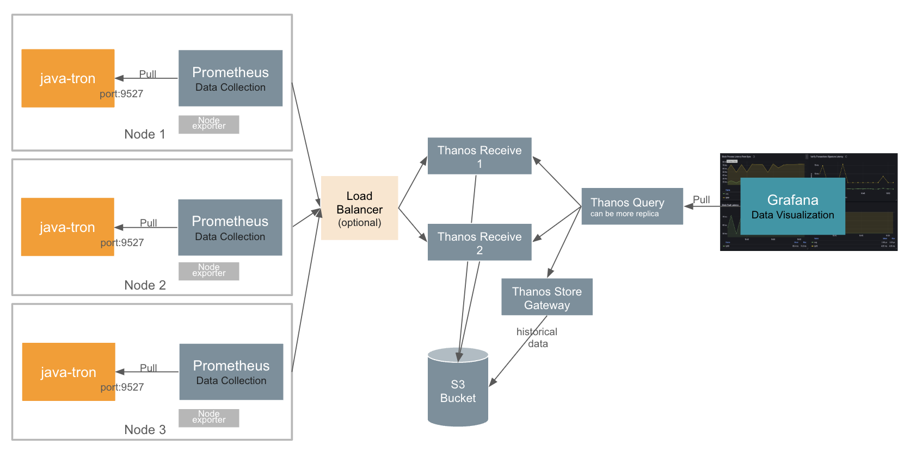

# Use Prometheus Remote Write with Thanos to Monitor java-tron Node

In this document, we will introduce how to use Prometheus remote-write to monitor a java-tron node more securely.

## Background
The previous [README](README.md) explains how to monitor a java-tron node using Grafana and Prometheus. It can be illustrated by the image below:


Basically, the Prometheus service pulls metrics from the java-tron node through an exposed port. Subsequently, Grafana retrieves these metrics from Prometheus to provide visualized insights and alerts.

This quick-start setup is only recommed on test enviornment, as there are some limitations to this approach. From a security perspective, it is essential to separate java-tron services and monitoring services into different network zones. Specifically, we need to isolate java-tron nodes, especially SR nodes, from external exposure to reduce risks such as Denial of Service (DoS) attacks. However, monitoring metrics and similar indicators of TRON blockchain status can be made more accessible to a broader range of users.
To address these concerns, we need to change the pull mode either from the java-tron or Prometheus service to push mode. Refer to Prometheus official documentation of ["Why do you pull rather than push"](https://prometheus.io/docs/introduction/faq/#why-do-you-pull-rather-than-push) and ["When to use the Pushgateway"](https://prometheus.io/docs/practices/pushing/#when-to-use-the-pushgateway), the best practice for long-live observation target is to use Prometheus pull mode, and put java-tron and Prometheus service in the same failure domain.

### New Architecture
Given these considerations, we will implement a push mode for the data flow from Prometheus to Grafana. Prometheus offers a **remote-write** feature that supports push mode, facilitating this transition. We have selected [Thanos](https://github.com/thanos-io/thanos) as an intermediate component. Thanos not only supports remote write but also provides additional features such as long-term storage, high availability, and global querying, thereby improving the overall architecture and functionality of our monitoring system.

The following diagram illustrates our enhanced monitoring system architecture in cluster mode with multiple java-tron services. This design provides improved reliability and scalability through distributed components. In the subsequent sections, we'll guide you through configuring Prometheus remote-write and Thanos services. For simpler use cases where high availability isn't critical, deploying a single Thanos Receive instance may suffice.



## Implementation Guide
This section introduces the steps of setting up Prometheus remote write with Thanos.

### Prerequisites
Before proceeding, ensure you have the following prerequisites:

- Docker and Docker Compose installed (refer to [prerequisites](../README.md#prerequisites))
  - For host machines running a java-tron FullNode, the minimum docker resource requirements, please refer to the [single_node](../single_node/README.md#prerequisites) section.
- A local clone of the tron-docker repository
  ```sh
  git clone https://github.com/tronprotocol/tron-docker.git
  cd tron-docker/metric_monitor
  ```
### Main components
As shown in the new architecture, the monitoring system consists of the following key components:

- **TRON FullNode**: A TRON blockchain node with metric collection capabilities enabled
- **Prometheus**: A monitoring service that collects metrics from the java-tron node and forwards them to Thanos Receive using remote write protocol
- **Thanos Receive**: A Thanos component that ingests metrics via Prometheus remote write, exposes them via StoreAPI, and persists them to cloud storage
- **Thanos Query**: A Thanos component implementing Prometheus's v1 API to aggregate and deduplicate metrics from multiple underlying data sources
- **Grafana**: A visualization platform that queries metrics from Thanos Query to create dashboards and alerts

### Step 1: Set up TRON and Prometheus services
Run the below command to start java-tron and Prometheus services:
```sh
docker-compose -f ./docker-compose/docker-compose-fullnode.yml up -d
```

Review the [docker-compose-fullnode.yml](./docker-compose/docker-compose-fullnode.yml) file, the command explanation of the java-tron service can be found in [Run Single Node](../single_node/README.md#run-the-container).

Below are the core configurations for the Prometheus service:
```yaml
  ports:
    - "9090:9090"  # Used for local Prometheus status check
  volumes:
    - ../conf:/etc/prometheus # Path relative to the docker compose file
    - ../prometheus_data:/prometheus
  command:
    - "--config.file=/etc/prometheus/prometheus-remote-write.yml" # Default path to the configuration file
    - "--storage.tsdb.path=/prometheus" # The path where Prometheus stores its metric database
    - "--storage.tsdb.retention.time=30d"
    - "--storage.tsdb.max-block-duration=30m" # The maximum duration for a block of time series data that can be stored in the time series database (TSDB)
    - "--storage.tsdb.min-block-duration=30m"
    - "--web.enable-lifecycle" # Makes Prometheus expose the /-/reload HTTP endpoints
    - "--web.enable-admin-api"
```
#### Key configuration elements:
##### 1. Prometheus configuration file

The Prometheus configuration file is set to use the [prometheus-remote-write.yml](conf/prometheus-remote-write.yml) by volume mapping `./conf/prometheus-remote-write.yml:...` and flag `--config.file=...`. It contains the configuration of `scrape_configs` and `remote_write`.
```yml
global:
  external_labels:
    monitor: 'java-tron-node1-remote-write'  # Unique identifier in Thanos

scrape_configs:
  - job_name: java-tron
    scrape_interval: 1s  # High-frequency monitoring
    ...
    static_configs:
      - targets: tron-node1:9527 # Fill with IP address if the java-tron service run remotely
        labels:
          group: group-tron
          instance: fullnode-01

remote_write:
  - url: http://[THANOS_RECEIVE_IP]:10908/api/v1/receive
    headers: # Add necessary header information for authentication or service group differentiation
    metadata_config:
      send: true  # Enable metric metadata transmission
      send_interval: 1s  # How frequently metric metadata is sent to remote Receive.
      max_samples_per_send: 500  # Batch size optimization
```
- For `global.external_labels`:
  - The `external_labels` defined in the Prometheus configuration file are propagated with all metric data to Thanos Receive. You could add multiple Prometheus services with remote-write to the same Receive service, just make sure the `external_labels` are unique. It uniquely identifies the Prometheus instance, acting as critical tracing metadata that ultimately correlates metrics to their originating java-tron node. You can use it in Grafana dashboards using label-based filtering (e.g., `{monitor="java-tron-node1-remote-write"}`).

    

- For `scrape_configs`:
  - The `scrape_interval` determines how frequently Prometheus collects metrics. Set to 1 second by default for real-time monitoring, though this can be adjusted based on your monitoring requirements. Note that shorter intervals increase the load on both Prometheus and the java-tron service, as metrics are collected via HTTP calls to `service:9527/metrics`.
  - The `targets` field specifies the java-tron services or other monitoring targets via their IP addresses and ports. Prometheus actively scrapes metrics from these defined endpoints.
  - The `labels` section contains key-value pairs that uniquely identify each target within Prometheus. These labels enable powerful filtering capabilities in Grafana dashboards - for example, you can filter metrics using expressions like `{group="group-tron"}`.

- For `remote_write`:
  - Fill the `url` with the IP address of the Thanos Receive service started in the following step.
  - Check the official documentation [remote_write](https://prometheus.io/docs/prometheus/latest/configuration/configuration/#remote_write) for all configurations' explanation.

##### 2. Storage configurations
- The volumes command `../prometheus_data:/prometheus` mounts a local directory used by Prometheus to store metrics data.
  - Although in this case, we use Prometheus with remote-write, it also stores metrics data locally. Through http://host_IP:9090/, you can check the running status of the Prometheus service and observe targets.
- The `--storage.tsdb.retention.time=30d` flag specifies the retention period for the metrics data. Prometheus will automatically delete data older than 30 days. For each metric request of a java-tron(v4.7.6+) FullNode connecting Mainnet, it returns ~9KB raw metric data. With the `scrape_interval: 1s`, it takes about 23GB per month raw data. TSDB will do compression, **thus for 30d retention, one java-tron takes about promethus 5GB**. The TSDB is useful for long-term storage and querying.
- The `--storage.tsdb.max-block-duration=1h` flags specify the block generation duration for the TSDB locally. In this case, it is set to 1 hours. This means that the TSDB will generate a new block every hour with about 30MB raw metric data.
- Other storage flags can be found in the [official documentation](https://prometheus.io/docs/prometheus/latest/storage/#operational-aspects). For a quick start, you could use the default values.

### Step 2: Set up Thanos Receive
 The [Thanos Receive](https://thanos.io/tip/components/receive.md/#receiver) service implements the Prometheus Remote Write API. It builds on top of the existing Prometheus TSDB and retains its usefulness while extending its functionality with long-term-storage, horizontal scalability, and downsampling. Prometheus instances are configured to continuously write metrics to it. Thanos Receive exposes the StoreAPI so that Thanos Queriers can query received metrics in real-time.


First, run the below command to start the [Minio](https://github.com/minio/minio) service for long-term metric storage. Minio is S3 compatible object storage service. Thanos Receive uploads TSDB blocks to an object storage bucket every 2 hours.
```sh
# Start Minio
docker-compose -f ./docker-compose/minio.yml up -d

 # First set the alias with root credentials
docker exec minio mc alias set local http://localhost:9000 minio melovethanos

# Then create the bucket
docker exec minio mc mb local/test-thanos-001
```

Run the below command to start the Thanos Receive.
```sh
docker-compose -f ./docker-compose/thanos-receive.yml up -d
```

Core configuration for Thanos Receive in [thanos-receive.yml](./docker-compose/thanos-receive.yml):
``` yml
  thanos-receive:
    ...
    container_name: thanos-receive
    volumes:
      - ../receive-data:/receive/data
      - ../conf:/receive # Path relative to the docker compose file
    ports:
      - "10907:10907"
      - "10908:10908"
      - "10909:10909"
    command:
      - "receive"
      - "--tsdb.path=/receive/data"
      - "--tsdb.retention=30d" # How long to retain raw samples on local storage.
      - "--grpc-address=0.0.0.0:10907"
      - "--http-address=0.0.0.0:10909"
      - "--remote-write.address=0.0.0.0:10908"
      - "--label=receive_replica=\"0\""
      - "--label=receive_cluster=\"java-tron-mainnet\""
      - "--objstore.config-file=/receive/bucket_storage_bucket.yml"
```
#### Key configuration elements:
##### 1. Storage configuration
- Local Storage:
  `../receive-data:/receive/data` maps the host directory for metric TSDB storage.
  - Retention Policy: `--tsdb.retention=30d` auto-purges data older than 30 days. **It takes less than 1GB of Receive disk space per month for one java-tron(v4.7.6) FullNode connecting Mainnet**.

- External Storage:
  `../conf:/receive` mounts configuration files. The `--objstore.config-file` flag enables long-term storage in MinIO/S3-compatible buckets. In this case, it is [bucket_storage_bucket.yml](conf/bucket_storage_bucket.yml).
  - Thanos Receive uploads TSDB blocks to an object storage bucket every 2 hours by default.
  - Fallback Behavior: Omitting this flag keeps data local-only.

##### 2. Network configuration
- Remote Write `--remote-write.address=0.0.0.0:10908`: Receives Prometheus metrics. Prometheus instances are configured to continuously write metrics to it.
- Thanos Receive exposes the StoreAPI so that Thanos Query can query received metrics in **real-time**.
  - The `ports` combined with flags `--grpc-address, --http-address` expose the ports for the Thanos Query service.
- Security Note: `0.0.0.0` means it accepts all incoming connections from any IP address. For production, consider restricting access to specific IP addresses.

For more flags explanation and default value can be found in the official [Thanos Receive Flags](https://thanos.io/tip/components/receive.md/#flags) documentation.

#### Thanos Receive reliable deployment
For systems monitoring multiple services with increasing scale, there are two approaches to prevent Thanos Receive from becoming a single point of failure or performance bottleneck:

1. Deploy multiple independent Thanos Receive instances, each dedicated to different monitoring targets. The configurations outlined in this document provide clear guidance for setting up this distributed architecture, as shown in the above architecture.

2. Implement Thanos Receive in cluster mode, which provides a unified entry point with automatic scaling capabilities. For detailed instructions on setting up Thanos Receive cluster mode, refer to the [Thanos receive cluster mode](THANOS_CLUSTER.md) guide.

### Step 3: Set up Thanos Store
While Thanos Receive handles recent data (30 days retention), Store Gateway provides access to older metrics persisted in object storage.

Run the below command to start the Thanos Query service:
```sh
docker-compose -f ./docker-compose/thanos-store.yml up -d
```

Core configuration in [thanos-store.yml](./docker-compose/thanos-store.yml):
```yaml
  thanos_store:
    command:
      - "store"
      - "--objstore.config-file=/etc/thanos/bucket_storage_bucket.yml"
      - "--grpc-address=0.0.0.0:10912"
```
The Store gateway:

1. Connects to our Minio bucket via bucket_storage_bucket.yml
2. Exposes gRPC endpoint (10912) for Thanos Query to access historical data
3. Indexes object storage blocks for fast lookups
With both Receive and Store connected to Query, we get seamless access to:

- Real-time data from Receive
- Historical data from Store

### Step 4: Set up Thanos Query
As Grafana cannot directly query Thanos Receive, we need Thanos Query that implements Prometheus’s v1 API to aggregate data from the Receive services. **Querier is fully stateless and horizontally scalable**.

Run the below command to start the Thanos Query service:
```sh
docker-compose -f ./docker-compose/thanos-querier.yml up -d
```

Below are the core configurations for the Thanos Query service:
``` yaml
  thanos-querier:
    ...
    container_name: thanos-querier
    ports:
      - "9091:9091"
    command:
      - query
      - --endpoint.info-timeout=30s
      - --http-address=0.0.0.0:9091
      - --query.replica-label=receive_replica # Deduplication turned on for metric with the same replica_label
      - --endpoint=thanos-receive-0:10907 # The grpc-address of the Thanos Receive service，if Receive run remotely replace container name "thanos-receive" with the real ip, could add multiple receive services
      - --store=thanos_store:10907 # for historical data query
```
It will set up the Thanos Query service
that listens to port 9091 and queries metrics from the Thanos Receive service from `--store=[Thanos Receive IP]:10907`.
Make sure the IP address is correct.

You could add multiple Thanos Receive services to the Querier service. It will do duplication based on the `replica-label`. For more complex usage, please refer to the [official Query document](https://thanos.io/tip/components/query.md/).

### Step 4: Monitor through Grafana
To start the Grafana service on the host machine, run the following command:
```sh
docker-compose -f ./docker-compose/grafana.yml up -d
```
Then log in to the Grafana web UI through http://localhost:3000/ or your host machine's IP address. The initial username and password are both `admin`.
Click the **Connections** on the left side of the main page and select Prometheus as datasource. Enter the IP and port of the Query service in URL with `http://[Query service IP]:9091`. If you run on the same host could use `http://thanos-querier:9091` or `http://host.docker.internal:9091` on MacOS.


Follow the same instruction as [Import Dashboard](https://github.com/tronprotocol/tron-docker/blob/main/metric_monitor/README.md#import-dashboard) to import the dashboard.
Then you can play with it with different Thanos Receive/Query, Prometheus configurations.

### Step 5: Clean up
To stop and remove all or part of the services, you could run the below commands:
```sh
docker-compose -f ./docker-compose/docker-compose-all.yml down # Stop and remove all services, if you start all on the same host
docker-compose -f ./docker-compose/thanos-receive.yml down # Thanos Receive service only
```

## Troubleshooting

### Common Issues
1. **Container Config Error (Linux)**
- If you encounter a `KeyError: 'ContainerConfig'`, check for conflicting container names and remove them:
   ```bash
  # List all containers
  docker ps -a

  # Remove conflicting containers
  docker rm [container-name]
  ```
2. **Network Connectivity**

- Verify all services can communicate by checking logs:
  ```bash
  docker-compose logs [service-name]
  ```

- Ensure all IP addresses are correctly configured in the docker-compose file
- Ensure all exposed ports are accessible from external services

3. **Storage Issues**

- Check available disk space: `df -h`
- Monitor storage usage in Prometheus, Thanos Receive, and Minio (if used) directories

### Getting Help
For additional support:
- Raise an issue on [GitHub](https://github.com/tronprotocol/tron-docker/issues)
- Consult the official Thanos documentation
- Review Docker logs for specific service issues

## Conclusion
This guide provides a secure and scalable solution for monitoring java-tron nodes. For custom configurations beyond this setup, refer to the [official Thanos documentation](https://thanos.io/tip/thanos/quick-tutorial.md/) or engage with the community on [GitHub](https://github.com/tronprotocol/tron-docker/issues) Issue.
