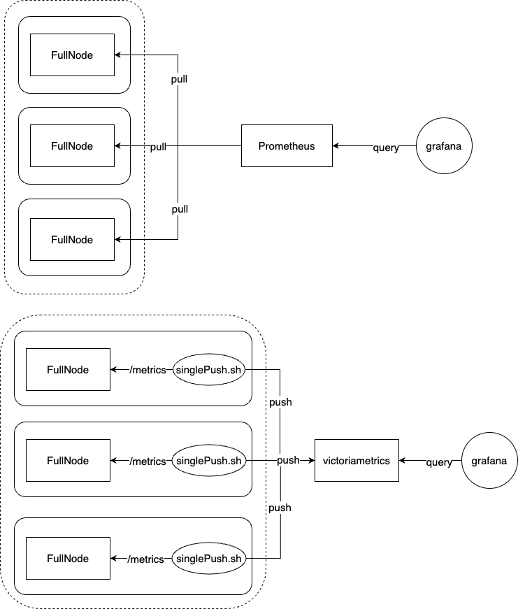
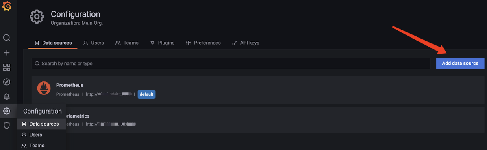
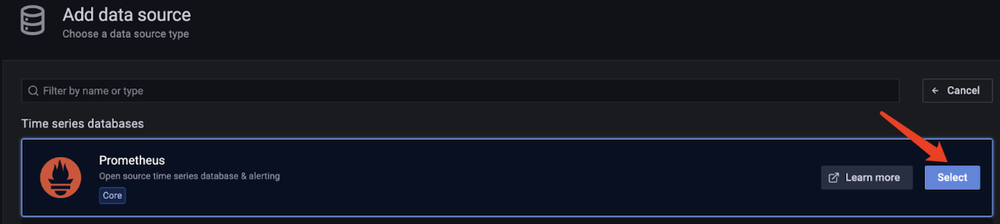
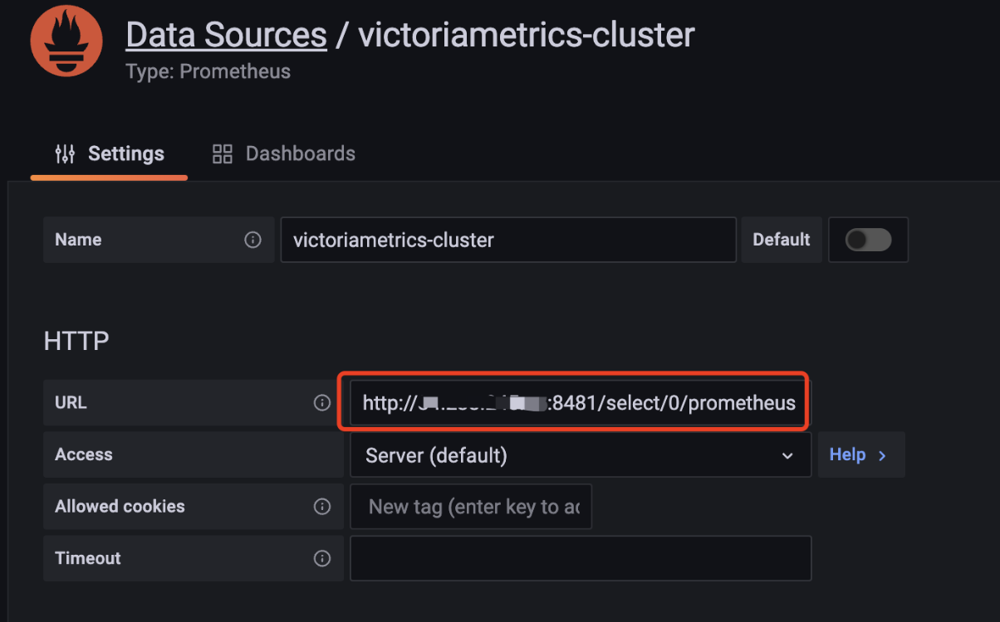
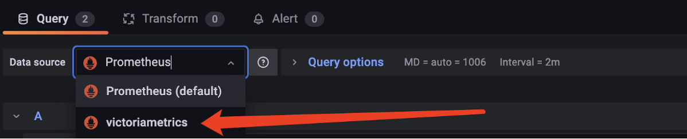

# Monitor java-tron nodes using VictoriaMetrics
This document aims to facilitate the monitoring of metrics for java-tron nodes through VictoriaMetrics.

## Background
Currently, Tron's FullNode and system monitoring infrastructure leverages a Grafana+Prometheus monitoring stack. In this setup, each FullNode exposes dedicated metrics ports that Prometheus uses to actively pull and store monitoring data. The metrics are then made available in Grafana by configuring Prometheus as a data source through the Grafana UI, using the appropriate IP address and port.

However, exposing specific ports on FullNode for Prometheus data collection poses potential security risks. To address this concern, our research led us to VictoriaMetrics - a solution that enables secure metrics collection through a push-based model, allowing for both efficient data storage and querying capabilities.

## Evolution of pull change push architecture:


## VictoriaMetrics
VictoriaMetrics is a high-performance, cost-efficient time series database and monitoring solution that excels in scalability and resource optimization.

Key features include:

- **Prometheus Integration**
  - Serves as a long-term storage solution for Prometheus
  - Seamlessly integrates with Grafana as a Prometheus alternative through API compatibility

- **Streamlined Operations**
  - Standalone executable with zero external dependencies
  - Simple configuration via command-line parameters with sensible defaults
  - Centralized data storage in a user-specified directory
  - Built-in backup/restore functionality via vmbackup/vmrestore tools

- **Advanced Querying and Performance**
  - Enhanced PromQL compatibility through MetricsQL
  - Unified querying across multiple data sources via a single interface
  - Superior scalability with up to 20x better performance than InfluxDB/TimescaleDB
  - Exceptional memory efficiency: uses 90% less memory than InfluxDB and 85% less than Prometheus/Thanos/Cortex

- **Storage Optimization**
  - Optimized for high churn rate time series
  - Industry-leading compression: 70x more data points per storage unit vs TimescaleDB
  - 7x reduced storage footprint compared to Prometheus/Thanos/Cortex
  - Optimized for high-latency and low IOPS storage: fully compatible with HDDs and cloud storage solutions (AWS, Google Cloud, Azure, etc.) as validated through comprehensive disk I/O testing

- **Enterprise-Grade Features**
  - Single node deployment can effectively replace medium-sized clusters built with Thanos, M3DB, Cortex, InfluxDB, or TimescaleDB (validated through vertical scaling tests, Thanos comparative analysis, and documented in PromCon 2019)
  - Built-in protection against data corruption from system failures
  - Comprehensive protocol support:
    - Prometheus (exporter metrics, remote write API, exposure format)
    - InfluxDB (HTTP/TCP/UDP)
    - Graphite, OpenTSDB, JSON, CSV, Native Binary
    - DataDog, NewRelic, OpenTelemetry
  - Available in both single-node and cluster editions

The following performance comparison between VictoriaMetrics and Prometheus is based on benchmark testing using `node_exporter` metrics. All measurements reflect single-server deployments for both solutions.

|         Feature          |            Prometheus             |               VictoriaMetrics               |
|:------------------------:|:---------------------------------:|:-------------------------------------------:|
|   **Data Collection**    |            Pull-based             |   Supports both pull-based and push-based   |
|    **Data Ingestion**    | Up to 240,000 samples per second  |      Up to 360,000 samples per second       |
|  **Query Performance**   |  Up to 80,000 queries per second  |      Up to 100,000 queries per second       |
|     **Memory Usage**     |          Up to 14GB RAM           |               Up to 4.3GB RAM               |
|   **Data Compression**   |       Uses LZF compression        |           Uses Snappy compression           |
| **Disk Write Frequency** | More frequent data writes to disk |      Less frequent data writes to disk      |
|   **Disk Space Usage**   |     Requires more disk space      |          Requires less disk space           |
|    **Query Language**    |              PromQL               | MetricsQL (backward-compatible with PromQL) |

## Deploy VictoriaMetrics
Follow these steps to deploy a highly available VictoriaMetrics cluster using Docker Compose:

1. **Launch the VictoriaMetrics Cluster**
   - Download the [docker-compose.yml](./victoria-metrics/docker-compose/docker-compose.yml) configuration file. This setup provides high availability with two storage nodes (vmstorage1 and vmstorage2)
   - Start the VictoriaMetrics cluster using the following command:
      ```shell
      # Enter into the directory of docker-compose.yml
      docker-compose up -d
      ```

2. **Configure Metric Collection**
   - Deploy the java-tron service with metrics enabled. For detailed instructions on enabling java-tron metrics collection, please refer to the [Quick Start Guide](README.md#quick-start).
   - Download the [clusterPush.sh](./victoria-metrics/shell/clusterPush.sh) script and deploy it on the same server as your java-tron service. This script collects java-tron metrics locally and pushes them to remote VictoriaMetrics clusters. Execute it using the following command:
      ```shell
      # Enter into the directory of clusterPush.sh
      # Make the script executable
      chmod +x ./clusterPush.sh
      # Run the script
      ./clusterPush.sh
      ```

3. **Verify Deployment**
   Test the setup by querying metrics through the vmselect API:
   ```shell
   curl 'http://localhost:8481/select/0/prometheus/api/v1/query?query={metrics}'
   ```
   Note: The '0' in the URL represents the tenant ID

### Key Storage Node Configurations

The following docker-compose configuration shows the essential settings for VictoriaMetrics storage nodes:
```yaml
services:
  vmstorage1:
    image: victoriametrics/vmstorage:latest
    command:
      ...
    ports:
      - "8482:8482"
      - "8400:8400"
      - "8401:8401"
    volumes:
      - ./storage1-data:/vmstorage-data # Data directory: Specify the storage path through
    ...

  vmstorage2:
    image: victoriametrics/vmstorage:latest
    command:
      ...
    ports:
      - "8483:8482"
      - "8402:8400"
      - "8403:8401"
    volumes:
      - ./storage2-data:/vmstorage-data # Data directory: Specify the storage path through
    ...
```
- **Volume Configuration**:
  - Storage Path: Configure the data directory using `-storageDataPath`
  - Best Practice: Use persistent volumes for reliable data storage

- **Port Configuration**:
  - 8480: Write port for cluster version (accepts Prometheus data)
  - 8481: Query port for cluster version

## Integrate with Grafana
After successfully pushing java-tron metrics to the VictoriaMetrics cluster, follow these steps to configure Grafana for accessing the metrics data:

1. **Verify Network Connectivity**
   - Ensure your Grafana instance can reach the VictoriaMetrics service
   - Test connectivity by accessing the VictoriaMetrics query API endpoint

2. **Add VictoriaMetrics Data Source**
   - Navigate to Configuration > Data Sources in Grafana
   - Click "Add data source"



3. **Select Data Source Type**
   - Choose "Prometheus" as the data source type (VictoriaMetrics is Prometheus-compatible)



4. **Configure Data Source Settings**
   - Enter the VictoriaMetrics URL (default query port: 8481)
   - Example URL format: `http://<victoriametrics-host>:8481`
   - Click "Save & Test" to verify the connection



5. **Verify Data Flow**
   - Open any Grafana dashboard panel
   - Click Edit > Query
   - Select the VictoriaMetrics data source
   - Check if metrics data appears in the graph


