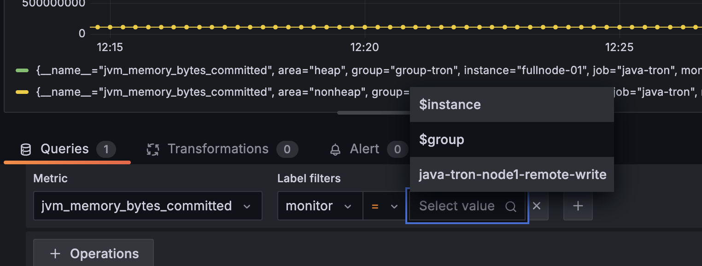
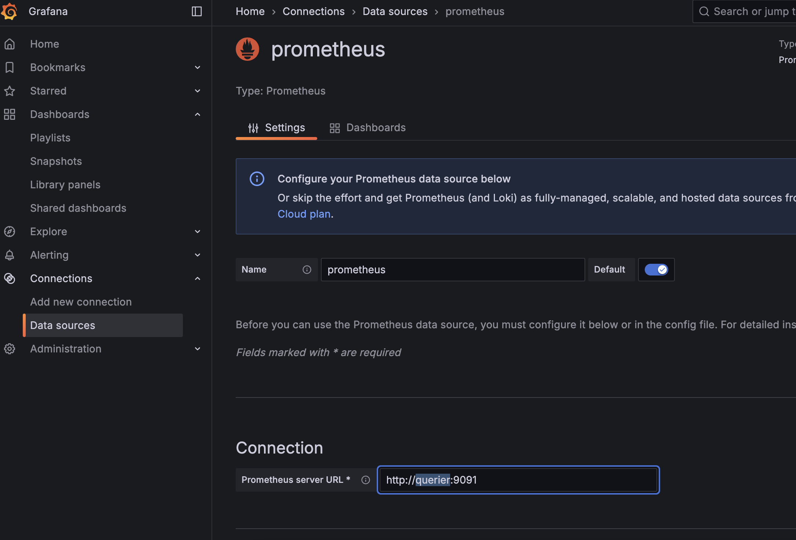

# Use Prometheus Remote Write with Thanos to Monitor java-tron Node

In this document, we will introduce how to use Prometheus remote-write to monitor a java-tron node more securely.

## Background
The previous [README](../README.md) explains how to monitor a java-tron node using Grafana and Prometheus. It can be illustrated by the image below:

Basically, the Prometheus service pulls metrics from the java-tron node through an exposed port. Subsequently, Grafana retrieves these metrics from Prometheus to provide visualized insights and alerts.

There are some limitations to this approach. From a security perspective, it is essential to separate java-tron services and monitoring services into different network zones. Specifically, we need to isolate java-tron nodes, especially SR nodes, from external exposure to reduce risks such as Denial of Service (DoS) attacks. However, monitoring metrics and similar indicators of TRON blockchain status can be made more accessible to a broader range of users.
To address these concerns, we need to change the pull mode either from the java-tron or Prometheus service to push mode. Refer to Prometheus official documentation of ["Why do you pull rather than push"](https://prometheus.io/docs/introduction/faq/#why-do-you-pull-rather-than-push) and ["When to use the Pushgateway"](https://prometheus.io/docs/practices/pushing/#when-to-use-the-pushgateway), the best practice for long-live observation target is to use Prometheus pull mode, and put java-tron and Prometheus service in the same failure domain.

### New Architecture
Given these considerations, we will implement a push mode for the data flow from Prometheus to Grafana. Prometheus offers a **remote-write** feature that supports push mode, facilitating this transition. We have selected [Thanos](https://github.com/thanos-io/thanos) as an intermediate component. Thanos not only supports remote write but also provides additional features such as long-term storage, high availability, and global querying, thereby improving the overall architecture and functionality of our monitoring system.

Below is the new architecture of the monitoring system. We will introduce how to set up the Prometheus remote-write feature and Thanos in the following sections.


## Implementation Guide
This section introduces the steps of setting up Prometheus remote write with Thanos.

### Prerequisites
Before starting, ensure you have:
- Docker and Docker Compose installed (refer to [prerequisites](../../README.md#prerequisites))
- The tron-docker repository cloned locally
```sh
git clone https://github.com/tronprotocol/tron-docker.git
cd tron-docker/metric_monitor/push_mode
```
### Main components
The monitoring system consists of:
- **TRON FullNode**: TRON FullNode service with metrics enabled
- **Prometheus**: Monitoring service that collects metrics from the java-tron node
- **Thanos Receive**: A component of Thanos that receives data from Prometheus’s remote write write-ahead log, exposes it, and/or uploads it to cloud storage
- **Thanos Query**: A component of Thanos that implements Prometheus’s v1 API to aggregate data from the underlying components
- **Grafana**: Visualization service that retrieves metrics from **Thanos Query** to provide visualized insights and alerts

### Step 1: Set up Thanos Receive
As we can see from the above architecture, Thanos Receive is the intermediate component we need to set up first. The [Thanos Receive](https://thanos.io/tip/components/receive.md/#receiver) service implements the Prometheus Remote Write API. It builds on top of the existing Prometheus TSDB and retains its usefulness while extending its functionality with long-term-storage, horizontal scalability, and downsampling.

Run the below command to start the Thanos Receive and [Minio](https://github.com/minio/minio) service for long-term metric storage:
```sh
docker-compose up -d thanos-receive minio
```

Core configuration for Thanos Receive in [docker-compose.yml](docker-compose.yml):
```
  thanos-receive:
    ...
    container_name: thanos-receive
    volumes:
      - ./receive-data:/receive/data
      - ./conf:/receive
    ports:
      - "10907:10907"
      - "10908:10908"
      - "10909:10909"
    command:
      - "receive"
      - "--tsdb.path=/receive/data"
      - "--tsdb.retention=15d" # How long to retain raw samples on local storage.
      - "--grpc-address=0.0.0.0:10907"
      - "--http-address=0.0.0.0:10909"
      - "--remote-write.address=0.0.0.0:10908"
      - "--label=receive_replica=\"0\""
      - "--label=receive_cluster=\"java-tron-mainnet\""
      - "--objstore.config-file=/receive/bucket_storage_minio.yml"
```
#### Key configuration elements:
##### 1. Storage configuration
- Local Storage:
  `./receive-data:/receive/data` maps the host directory for metric TSDB storage.
  - Retention Policy: `--tsdb.retention=15d` auto-purges data older than 15 days. As observed, it takes about 0.5GB of disk space per month for one java-tron(v4.7.6) FullNode connecting Mainnet.

- External Storage:
  `./conf:/receive` mounts configuration files. The `--objstore.config-file` flag enables long-term storage in MinIO/S3-compatible buckets. In this case, it is [bucket_storage_minio.yml](conf/bucket_storage_minio.yml).
  - Thanos Receive uploads TSDB blocks to an object storage bucket every 2 hours by default.
  - Fallback Behavior: Omitting this flag keeps data local-only.

##### 2. Network configuration
- Remote Write `--remote-write.address=0.0.0.0:10908`: Receives Prometheus metrics. Prometheus instances are configured to continuously write metrics to it.
- Thanos Receive exposes the StoreAPI so that Thanos Query can query received metrics in **real-time**.
  - The `ports` combined with flags `--grpc-address, --http-address` expose the ports for the Thanos Query service.
- Security Note: `0.0.0.0` means it accepts all incoming connections from any IP address. For production, consider restricting access to specific IP addresses.

##### 3. Operational parameters

- `--label=receive_replica=.` and `--label=receive_cluster=.`: Cluster labels ensure unique identification in the Thanos ecosystem. You could find these labels in Grafana dashboards. You could add any key-value pairs as labels.


For more flags explanation and default value can be found in the official [Thanos Receive Flags](https://thanos.io/tip/components/receive.md/#flags) documentation.

### Step 2: Set up TRON and Prometheus services
Run the below command to start java-tron and Prometheus services:
```sh
docker-compose up -d tron-node prometheus
```

Review the [docker-compose.yml](docker-compose.yml) file, the command explanation of the java-tron service can be found in [Run Single Node](../../single_node/README.md#run-the-container).

Below are the core configurations for the Prometheus service:
```yaml
  ports:
    - "9090:9090"  # Used for local Prometheus status check
  volumes:
    - ./conf:/etc/prometheus
    - ./prometheus_data:/prometheus
  command:
    - "--config.file=/etc/prometheus/prometheus.yml" # Default path to the configuration file
    - "--storage.tsdb.path=/prometheus" # The path where Prometheus stores its metric database
    - "--storage.tsdb.retention.time=30d"
    - "--storage.tsdb.max-block-duration=30m" # The maximum duration for a block of time series data that can be stored in the time series database (TSDB)
    - "--storage.tsdb.min-block-duration=30m"
    - "--web.enable-lifecycle" # Makes Prometheus expose the /-/reload HTTP endpoints
    - "--web.enable-admin-api"
```
#### Key configuration elements:
##### 1. Storage configurations
- The volumes command `- ./prometheus_data:/prometheus` mounts a local directory used by Prometheus to store metrics data.
  - Although in this case, we use Prometheus with remote-write, it also stores metrics data locally. Through http://localhost:9090/, you can check the running status of the Prometheus service and observe targets.
- The `--storage.tsdb.retention.time=30d` flag specifies the retention period for the metrics data. Prometheus will automatically delete data older than 30 days. As observed, it takes about 1GB of disk space per month for one java-tron(v4.7.6) FullNode connecting Mainnet. Notice this value is larger than the space needed by Thanos Receive for the same period, as there exist compact operations.
- Other storage flags can be found in the [official documentation](https://prometheus.io/docs/prometheus/latest/storage/#operational-aspects). For a quick start, you could use the default values.

##### 2. Prometheus remote-write configuration

The Prometheus configuration file is set to use the [prometheus.yml](conf/prometheus.yml) by volume mapping `./conf/prometheus.yml:...` and flag `--config.file=...`.
It contains the configuration of `scrape_configs` and `remote_write`.
You need to fill the `url` with the IP address of the Thanos Receive service started in the first step.
Check the official documentation [remote_write](https://prometheus.io/docs/prometheus/latest/configuration/configuration/#remote_write) for all configurations'
explanation.

```
global:
  external_labels:
    monitor: 'java-tron-node1-remote-write'  # Unique identifier in Thanos

scrape_configs:
  - job_name: java-tron
    scrape_interval: 3s  # High-frequency monitoring
    ...
    static_configs:
      - targets: [tron-node1:9527]
        labels:
          group: group-tron
          instance: fullnode-01

remote_write:
  - url: http://[THANOS_RECEIVE_IP]:10908/api/v1/receive
    metadata_config:
      send: true  # Enable metric metadata transmission
      send_interval: 3s  # How frequently metric metadata is sent to remote Receive.
      max_samples_per_send: 500  # Batch size optimization
```
The `external_labels` defined in the Prometheus configuration file are propagated with all metric data to Thanos Receive.
It uniquely identifies the Prometheus instance,
acting as critical tracing metadata that ultimately correlates metrics to their originating java-tron node.
You can use it in Grafana dashboards using label-based filtering (e.g., `{monitor="java-tron-node1-remote-write"}`).



Notice: You could add multiple Prometheus services with remote-write to the same Receive service, just make sure the `external_labels` are unique.

### Step 3: Set up Thanos Query
So far, we have Thanos Receive, Prometheus, and java-tron services running. The java-tron as the origin produces metrics, then pulled by the Prometheus service, which then keeps pushing metrics to Thanos Receive.
As Grafana cannot directly query Thanos Receive, we need Thanos Query that implements Prometheus’s v1 API to aggregate data from the underlying components.

Run the below command to start the Thanos Query service:
```sh
docker-compose up -d querier
```

Below are the core configurations for the Thanos Query service:
``` yaml
  querier:
    ...
    container_name: querier
    ports:
      - "9091:9091"
    command:
      - query
      - --endpoint.info-timeout=30s
      - --http-address=0.0.0.0:9091
      - --store=[Thanos Receive IP]:10907 # --store: The grpc-address of the Thanos Receive service，if Receive run remotely replace container name "thanos-receive" with the real IP
```
It will set up the Thanos Query service
that listens to port 9091 and queries metrics from the Thanos Receive service from `--store=[Thanos Receive IP]:10907`.
Make sure the IP address is correct.
For more complex usage, please refer to the [official Query document](https://thanos.io/tip/components/query.md/).

### Step 4: Monitor through Grafana
To start the Grafana service on the host machine, run the following command:
```sh
docker-compose up -d grafana
```
Then log in to the Grafana web UI through http://localhost:3000/ or your host machine's IP address. The initial username and password are both `admin`.
Click the **Connections** on the left side of the main page and select "Data Sources" to configure Grafana data sources. Enter the IP and port of the Query service in URL with `http://[Query service IP]:9091`.


Follow the same instruction as [Import Dashboard](../README.md#grafana-service) to import the dashboard.
Then you can play with it with different Thanos Receive/Query, Prometheus configurations.

### Step 5: Clean up
To stop and remove all or part of the services, you could run the below commands:
```sh
docker-compose down # Stop and remove all services
docker-compose down thanos-receive # Thanos Receive service only
docker-compose down prometheus, tron-node, querier, grafana # Multiple Services at once
```

## Troubleshooting

### Common Issues
1. **Container Config Error (Linux)**
- If you encounter a `KeyError: 'ContainerConfig'`, check for conflicting container names and remove them:
   ```bash
  # List all containers
  docker ps -a

  # Remove conflicting containers
  docker rm [container-name]
  ```
2. **Network Connectivity**

- Verify all services can communicate by checking logs:
  ```bash
  docker-compose logs [service-name]
  ```

- Ensure all IP addresses are correctly configured in the compose file

3. **Storage Issues**

- Check available disk space: `df -h`
- Monitor storage usage in Prometheus, Thanos Receive, and Minio (if used) directories

### Getting Help
For additional support:
- Raise an issue on [GitHub](https://github.com/tronprotocol/tron-docker/issues)
- Consult the official Thanos documentation
- Review Docker logs for specific service issues

## Conclusion
This guide provides a secure and scalable solution for monitoring java-tron nodes. For custom configurations beyond this setup, refer to the [official Thanos documentation](https://thanos.io/tip/thanos/quick-tutorial.md/) or engage with the community on [GitHub](https://github.com/tronprotocol/tron-docker/issues) Issue.
