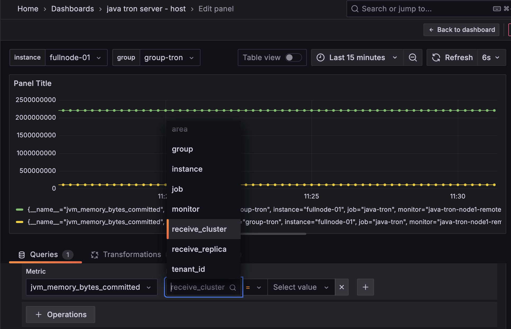

# Use Prometheus Remote Write to Monitor java-tron Node

In this README, we will introduce how to use Prometheus remote-write to monitor java-tron node more securely.

## Background
The previous [README](../README.md) explains how to monitor a java-tron node using Grafana and Prometheus. It can be illustrated by the image below:

Basically, the Prometheus service pulls metrics from java-tron node through an exposed port. Subsequently, Grafana retrieves these metrics from Prometheus to provide visualized insights and alerts.

There are some limitations to this approach. From a security perspective, it is essential to separate java-tron services and monitoring services into different network zones. Specifically, we need isolate java-tron nodes, especially SR nodes, from external exposure to reduce risks such as Denial of Service (DoS) attacks. However, monitoring metrics and similar indicators of TRON blockchain status can be made more accessible to a broader range of users.
To address these concerns, we need to change the pull mode either from java-tron or Prometheus service to push mode. Refer to Prometheus official documentation of ["Why do you pull rather than push"](https://prometheus.io/docs/introduction/faq/#why-do-you-pull-rather-than-push) and ["When to use the Pushgateway"](https://prometheus.io/docs/practices/pushing/#when-to-use-the-pushgateway), the best practise for long-live observation target is to use Prometheus pull mode, and put java-tron and Prometheus service in the same failure domain.

### New Architecture
Given these considerations, we will implement a push mode for the data flow from Prometheus to Grafana. Prometheus offers a **remote-write** feature that supports push mode, facilitating this transition. We have selected [Thanos](https://github.com/thanos-io/thanos) as an intermediate component. Thanos not only supports remote write but also provides additional features such as long-term storage, high availability, and global querying, thereby improving the overall architecture and functionality of our monitoring system.

Below is the new architecture of the monitoring system. We will introduce how to set up the Prometheus remote-write feature and Thanos in the following sections.


## Use Prometheus remote write with Thanos guidance
This section introduce the steps of setting up Prometheus remote write with Thanos.

### Prerequisites

- Docker and Docker Compose: Installation refer [prerequisites](../../README.md#prerequisites).
- Clone the tron-docker repository, then navigate to the `push_mode` directory.
```sh
git clone https://github.com/tronprotocol/tron-docker.git
cd tron-docker/metric_monitor/push_mode
```
### Main Components
Before we start, let's list the main components of the monitoring system:
- **TRON FullNode**: TRON FullNode service with metrics enabled
- **Prometheus**: Monitoring service that collects metrics from java-tron node
- **Thanos Receive**: A component of Thanos that receives data from Prometheus’s remote write write-ahead log, exposes it, and/or uploads it to cloud storage.
- **Thanos Query**: A component of Thanos that implements Prometheus’s v1 API to aggregate data from the underlying components.
- **Grafana**: Visualization service that retrieves metrics from **Thanos Query** to provide visualized insights and alerts.

### Step 1: Set up Thanos Receive
As we can see from the above architecture, Thanos Receive is the intermediate component we need to set up first. The [Thanos Receive](https://thanos.io/tip/components/receive.md/#receiver) command implements the Prometheus Remote Write API. It builds on top of existing Prometheus TSDB and retains its usefulness while extending its functionality with long-term-storage, horizontal scalability, and downsampling.

Run below command to start Thanos Receive service and a minio service for long-term metric storage:
```sh
docker-compose -f docker-compose-receive.yml up -d
```

Core configuration in [docker-compose-receive.yml](docker-compose-receive.yml):
```aiignore
services:
  thanos-receive:
    ...
    container_name: thanos-receive
    volumes:
      - ./receive-data:/receive/data
      - ./conf:/receive
    ports:
      - "10907:10907"
      - "10908:10908"
      - "10909:10909"
    command:
      - "receive"
      - "--tsdb.path=/receive/data"
      - "--tsdb.retention=15d" # How long to retain raw samples on local storage.
      - "--grpc-address=0.0.0.0:10907"
      - "--http-address=0.0.0.0:10909"
      - "--remote-write.address=0.0.0.0:10908"
      - "--label=receive_replica=\"0\""
      - "--label=receive_cluster=\"java-tron-mainnet\""
      - "--objstore.config-file=/receive/bucket_storage_minio.yml"
```
#### Key Configuration Elements:
##### 1. Storage Configuration
- Local Storage:
`./receive-data:/receive/data` maps host directory for metric TSDB storage.
  - Retention Policy: `--tsdb.retention=15d` auto-purges data older than 15 days. As observed, it takes about 0.5GB of disk space per month for one java-tron(v4.7.6) FullNode connecting Mainnet.

- External Storage:
`./conf:/receive` mounts configuration files. The -`-objstore.config-file` flag enables long-term storage in MinIO/S3-compatible buckets. In this case it is [bucket_storage_minio.yml](conf/bucket_storage_minio.yml).
  - Fallback Behavior: Omitting this flag keeps data local-only.
  -
##### 2. Network Configuration
- The `ports` combined with flags `--grpc-address, --http-address` expose the ports for Thanos Query service to access.
- Remote Write `--remote-write.address=0.0.0.0:10908`: Receives Prometheus remote write metrics.
- Security Note: `0.0.0.0` means it accepts all incoming connections from any IP address. For production, consider restricting access to specific IP addresses.

##### 3. Operational Parameters

- `--label=receive_replica=.` and `--label=receive_cluster=.`: Cluster labels ensure unique identification in Thanos ecosystem. You could find these labels in Grafana dashboards. You could add any key value pairs as labels.



For more flags explanation and default value can be found in official [Thanos documentation](https://thanos.io/tip/components/receive.md/#flags).

### Step 2: Set up TRON and Prometheus services
Run below command to start java-tron and Prometheus services:
```sh
docker-compose -f docker-compose-tron-prometheus.yml up -d
```
Review the [docker-compose-tron-prometheus.yml](docker-compose-tron-prometheus.yml) file, the command explanation of java-tron service can be found in the [README](../single_node/README.md#run-the-container).

Below are the key configurations for the Prometheus service:
```
  prometheus:
    ...
    volumes:
      - ./conf/prometheus-remote-write.yml:/etc/prometheus/prometheus.yml
      - ./prometheus_data:/prometheus
    command:
      - --config.file=/etc/prometheus/prometheus.yml # the default path to the configuration file
      - --storage.tsdb.path=/prometheus # the path where Prometheus stores its metric database
      - --storage.tsdb.retention.time=30d # takes about 1GB of disk space per month
      - --storage.tsdb.max-block-duration=30m #the maximum duration for a block of time series data that can be stored in the time series database (TSDB)
      - --storage.tsdb.min-block-duration=30m
      - --web.enable-lifecycle # tell Prometheus to expose the /-/reload HTTP endpoints
      - --web.enable-admin-api
    ...
```
#### Prometheus remote-write configuration

Prometheus configuration file is set to use the local [prometheus-remote-write.yml](conf/prometheus-remote-write.yml) by volume mapping `./conf/prometheus-remote-write.yml:...` and command `--config.file=...`. It contains configuration of `scrape_configs` and `remote_write`.
We need to fill the `url` with the IP address of the Thanos receive service. Check the official documentation for [remote_write](https://prometheus.io/docs/prometheus/latest/configuration/configuration/#remote_write) other default configurations.

```yaml
remote_write:
  - url: http://172.17.0.1:10908/api/v1/receive # change to the actual IP address of the Thanos receive service
    # other configurations
    metadata_config:
      send: true # Whether to send metadata information about the metric to the remote storage.
      send_interval: 3s # How frequently metric metadata is sent to remote storage.
      max_samples_per_send: 500
```
**Prometheus other configurations**
The second volume mounts a local directory (./prometheus_data) into the container at /prometheus. This directory is used by Prometheus to store its time-series database (TSDB) and other data.


### step 3: Set up Thanos Query, Grafana
Querier/Query: implements Prometheus’s v1 API to aggregate data from the underlying components.
